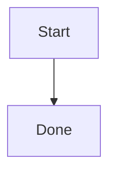

# Chat Visual Export Implementation Plan

> **For agentic workers:** REQUIRED SUB-SKILL: Use superpowers:subagent-driven-development (recommended) or superpowers:executing-plans to implement this plan task-by-task. Steps use checkbox (`- [ ]`) syntax for tracking.

**Goal:** Add image download and image clipboard-copy actions for the two chat visuals that are already rendered as image assets: markdown/tool-result images and Mermaid diagrams.

**Architecture:** Keep the feature frontend-only and local to the existing chat render path. `ChatImage` exports the original image file URL, while `MermaidDiagram` exports the rendered SVG as a PNG blob. A small shared helper module owns blob fetching, PNG conversion, clipboard writes, and browser downloads so the UI components stay focused on state and controls.

**Tech Stack:** Next.js 16 App Router, React 19 client components, assistant-ui chat rendering, Mermaid 11, Tailwind v4 design-token CSS, Vitest/jsdom, sonner toasts, browser Clipboard API.

---

## Scope

In scope:

- Markdown image visuals rendered by `ChatImage`.
- Tool-result image visuals that already reuse `ChatImage`.
- Mermaid fenced-code diagrams rendered by `MermaidDiagram`.
- Download visual as an image file.
- Copy visual as an image blob to the OS clipboard.

Out of scope:

- DOM-card capture for search cards, Deep Research summaries, phase timelines, approval cards, code blocks, or tables.
- Adding `html-to-image`, `dom-to-image`, `canvas`, or a screenshot dependency.
- Backend API changes.
- Message-level copy behavior.

## Current Source Map

- `frontend/src/components/chat/markdown-content.tsx:22-24` lazy-loads Mermaid.
- `frontend/src/components/chat/markdown-content.tsx:107-175` defines `ChatImage`; this is the central image renderer.
- `frontend/src/components/chat/markdown-content.tsx:214-217` maps markdown `` to `ChatImage`.
- `frontend/src/components/chat/mermaid-diagram.tsx:27-82` renders Mermaid SVG with `mermaid.render(...)` and `dangerouslySetInnerHTML`.
- `frontend/src/components/chat/tool-ui/generic-tool-ui.tsx:25-81` extracts image URLs from generic tool results.
- `frontend/src/components/chat/tool-ui/generic-tool-ui.tsx:141-145` renders extracted image URLs through `ChatImage`.
- `frontend/src/components/chat/right-rail/tool-result-panel-content.tsx:77-79` renders direct image tool results through `ChatImage`.
- `backend/app/routers/conversations.py:1334-1367` serves original and preview conversation files. The frontend should continue using previews for display and original URLs for export.

## File Structure

- Create `frontend/src/lib/chat/visual-export.ts`
  - Pure browser helpers for filename derivation, blob download, remote image fetch, SVG-to-PNG conversion, and clipboard image writes.
- Create `frontend/src/lib/chat/__tests__/visual-export.test.ts`
  - Unit tests for URL filename derivation, SVG filename derivation, download URL creation, and unsupported clipboard errors.
- Create `frontend/src/components/chat/visual-export-actions.tsx`
  - Shared two-button action bar with download/copy icons, pending state, success state, error toasts, and accessible labels.
- Modify `frontend/src/components/chat/markdown-content.tsx`
  - Add `VisualExportActions` to `ChatImage`.
  - Use original `resolvedSrc`, not `previewSrc`, for export.
- Modify `frontend/src/components/chat/mermaid-diagram.tsx`
  - Add `VisualExportActions` after successful SVG render.
  - Export Mermaid as PNG with a background color read from the rendered card.
- Modify `frontend/src/components/chat/markdown-styles.css`
  - Add reusable `.chat-visual-*` classes for action overlay and buttons.
- Modify `frontend/messages/ko.json`
  - Add Korean labels and toast copy under `chat.visualExport`.
- Modify `frontend/messages/en.json`
  - Add English labels and toast copy under `chat.visualExport`.
- Modify `frontend/src/components/chat/__tests__/markdown-content.test.tsx`
  - Verify `ChatImage` calls image export helpers with original source URLs.
- Create `frontend/src/components/chat/__tests__/mermaid-diagram.test.tsx`
  - Verify Mermaid renders SVG and calls Mermaid export helpers.

## Product Decisions

- Show export controls as icon buttons over the visual, visible on hover and focus.
- Use `DownloadIcon` and `ClipboardIcon` from `lucide-react`.
- Keep the existing click-to-preview behavior for images. Export buttons must call `stopPropagation()` so they do not open the preview dialog.
- For `ChatImage`, download the original blob from `resolvedSrc`; do not download the preview WebP.
- For `ChatImage`, copy a PNG-normalized blob to the clipboard. This makes JPEG/WebP/SVG images behave consistently in Chrome-style clipboard targets.
- For `MermaidDiagram`, download/copy PNG. The SVG source is an implementation detail; the user-facing action is image export.
- If Clipboard API image writes are unavailable, show an error toast. Do not silently copy the URL because the requested operation is image copy, not link copy.
- If fetching a third-party image fails due to CORS, show an error toast for copy. For download, the helper may fall back to a normal anchor URL download.

## Task 1: Shared Visual Export Helpers

**Files:**

- Create: `frontend/src/lib/chat/visual-export.ts`
- Create: `frontend/src/lib/chat/__tests__/visual-export.test.ts`

- [ ] **Step 1: Write helper tests first**

Create `frontend/src/lib/chat/__tests__/visual-export.test.ts`.

```ts
import { afterEach, describe, expect, it, vi } from 'vitest'
import {
  buildDownloadFilename,
  createSvgBlob,
  downloadBlob,
  requireClipboardImageWrite,
} from '../visual-export'

describe('visual export helpers', () => {
  afterEach(() => {
    vi.restoreAllMocks()
  })

  it('builds a filename from an image URL path', () => {
    expect(
      buildDownloadFilename(
        'http://localhost:8001/api/conversations/c1/files/generated-guide.png?variant=preview',
        'chat-image',
        'png',
      ),
    ).toBe('generated-guide.png')
  })

  it('adds an extension when the URL has no usable extension', () => {
    expect(buildDownloadFilename('data:image/png;base64,abc', 'chat-image', 'png')).toBe(
      'chat-image.png',
    )
  })

  it('creates an SVG blob with the expected MIME type', async () => {
    const blob = createSvgBlob('<svg viewBox="0 0 10 10"></svg>')

    expect(blob.type).toBe('image/svg+xml;charset=utf-8')
    await expect(blob.text()).resolves.toContain('<svg')
  })

  it('throws a clear error when image clipboard write is unavailable', () => {
    vi.stubGlobal('ClipboardItem', undefined)
    Object.defineProperty(navigator, 'clipboard', {
      configurable: true,
      value: undefined,
    })

    expect(() => requireClipboardImageWrite()).toThrow('Image clipboard copy is not supported')
  })

  it('downloads a blob through a temporary object URL', () => {
    const appendChild = vi.spyOn(document.body, 'appendChild')
    const removeChild = vi.spyOn(document.body, 'removeChild')
    const click = vi.fn()
    const revokeObjectURL = vi.fn()
    const createObjectURL = vi.fn(() => 'blob:visual-export')

    vi.stubGlobal('URL', {
      createObjectURL,
      revokeObjectURL,
    })
    vi.spyOn(document, 'createElement').mockImplementation((tagName: string) => {
      const element = document.createElementNS('http://www.w3.org/1999/xhtml', tagName)
      if (tagName === 'a') {
        Object.defineProperty(element, 'click', { value: click })
      }
      return element as HTMLElement
    })

    downloadBlob(new Blob(['hello'], { type: 'text/plain' }), 'hello.txt')

    expect(createObjectURL).toHaveBeenCalledOnce()
    expect(click).toHaveBeenCalledOnce()
    expect(revokeObjectURL).toHaveBeenCalledWith('blob:visual-export')
    expect(appendChild).toHaveBeenCalled()
    expect(removeChild).toHaveBeenCalled()
  })
})
```

- [ ] **Step 2: Run the tests and confirm they fail**

Run:

```bash
cd frontend && pnpm test src/lib/chat/__tests__/visual-export.test.ts --run
```

Expected: fail because `frontend/src/lib/chat/visual-export.ts` does not exist.

- [ ] **Step 3: Create the helper module**

Create `frontend/src/lib/chat/visual-export.ts`.

```ts
const IMAGE_EXTENSIONS = new Set(['png', 'jpg', 'jpeg', 'webp', 'gif', 'svg', 'avif'])

export function buildDownloadFilename(
  source: string,
  fallbackBase: string,
  fallbackExtension: string,
): string {
  try {
    const url = new URL(source, window.location.href)
    const lastSegment = decodeURIComponent(url.pathname.split('/').filter(Boolean).at(-1) ?? '')
    const extension = lastSegment.split('.').at(-1)?.toLowerCase()
    if (lastSegment && extension && IMAGE_EXTENSIONS.has(extension)) {
      return lastSegment
    }
  } catch {
    // Non-URL values such as malformed data URLs use the fallback below.
  }

  const cleanBase = fallbackBase
    .trim()
    .toLowerCase()
    .replace(/[^a-z0-9가-힣._-]+/gi, '-')
    .replace(/^-+|-+$/g, '')
  return `${cleanBase || 'chat-visual'}.${fallbackExtension}`
}

export function createSvgBlob(svg: string): Blob {
  return new Blob([svg], { type: 'image/svg+xml;charset=utf-8' })
}

export function downloadBlob(blob: Blob, filename: string): void {
  const objectUrl = URL.createObjectURL(blob)
  const anchor = document.createElement('a')
  anchor.href = objectUrl
  anchor.download = filename
  anchor.rel = 'noopener'
  document.body.appendChild(anchor)
  anchor.click()
  document.body.removeChild(anchor)
  URL.revokeObjectURL(objectUrl)
}

export function requireClipboardImageWrite(): typeof ClipboardItem {
  if (!navigator.clipboard?.write || typeof ClipboardItem === 'undefined') {
    throw new Error('Image clipboard copy is not supported')
  }
  return ClipboardItem
}

export async function copyBlobToClipboard(blob: Blob): Promise<void> {
  const ClipboardItemCtor = requireClipboardImageWrite()
  await navigator.clipboard.write([
    new ClipboardItemCtor({
      [blob.type || 'image/png']: blob,
    }),
  ])
}

export async function fetchVisualBlob(source: string): Promise<Blob> {
  if (source.startsWith('data:')) {
    return fetch(source).then((response) => response.blob())
  }

  const response = await fetch(source, {
    credentials: 'include',
  })
  if (!response.ok) {
    throw new Error(`Failed to fetch visual: ${response.status}`)
  }
  return response.blob()
}

function loadImageFromBlob(blob: Blob): Promise<HTMLImageElement> {
  return new Promise((resolve, reject) => {
    const objectUrl = URL.createObjectURL(blob)
    const image = new Image()
    image.onload = () => {
      URL.revokeObjectURL(objectUrl)
      resolve(image)
    }
    image.onerror = () => {
      URL.revokeObjectURL(objectUrl)
      reject(new Error('Failed to decode image for export'))
    }
    image.src = objectUrl
  })
}

async function imageBlobToPngBlob(blob: Blob, backgroundColor?: string): Promise<Blob> {
  const image = await loadImageFromBlob(blob)
  const canvas = document.createElement('canvas')
  canvas.width = image.naturalWidth || image.width
  canvas.height = image.naturalHeight || image.height
  const context = canvas.getContext('2d')
  if (!context) {
    throw new Error('Canvas export is not available')
  }

  if (backgroundColor) {
    context.fillStyle = backgroundColor
    context.fillRect(0, 0, canvas.width, canvas.height)
  }
  context.drawImage(image, 0, 0)

  return new Promise((resolve, reject) => {
    canvas.toBlob((pngBlob) => {
      if (!pngBlob) {
        reject(new Error('Failed to encode image as PNG'))
        return
      }
      resolve(pngBlob)
    }, 'image/png')
  })
}

export async function downloadRemoteImage(source: string, filename: string): Promise<void> {
  try {
    const blob = await fetchVisualBlob(source)
    downloadBlob(blob, filename)
  } catch (error) {
    const anchor = document.createElement('a')
    anchor.href = source
    anchor.download = filename
    anchor.rel = 'noopener'
    document.body.appendChild(anchor)
    anchor.click()
    document.body.removeChild(anchor)
    if (error instanceof Error && source.startsWith('data:')) {
      throw error
    }
  }
}

export async function copyRemoteImageToClipboard(source: string): Promise<void> {
  const blob = await fetchVisualBlob(source)
  const pngBlob = blob.type === 'image/png' ? blob : await imageBlobToPngBlob(blob)
  await copyBlobToClipboard(pngBlob)
}

function parseSvgDimension(value: string | null): number | null {
  if (!value) return null
  const parsed = Number.parseFloat(value)
  return Number.isFinite(parsed) && parsed > 0 ? parsed : null
}

function getSvgSize(svg: string): { width: number; height: number } {
  const doc = new DOMParser().parseFromString(svg, 'image/svg+xml')
  const svgNode = doc.querySelector('svg')
  const width = parseSvgDimension(svgNode?.getAttribute('width') ?? null)
  const height = parseSvgDimension(svgNode?.getAttribute('height') ?? null)
  if (width && height) return { width, height }

  const viewBox = svgNode?.getAttribute('viewBox')?.split(/\s+/).map(Number)
  if (viewBox && viewBox.length === 4 && viewBox.every(Number.isFinite)) {
    return { width: Math.max(1, viewBox[2]), height: Math.max(1, viewBox[3]) }
  }

  return { width: 1024, height: 768 }
}

export async function svgToPngBlob(
  svg: string,
  options: { backgroundColor?: string; scale?: number } = {},
): Promise<Blob> {
  const size = getSvgSize(svg)
  const scale = options.scale ?? 2
  const svgBlob = createSvgBlob(svg)
  const image = await loadImageFromBlob(svgBlob)
  const canvas = document.createElement('canvas')
  canvas.width = Math.ceil(size.width * scale)
  canvas.height = Math.ceil(size.height * scale)
  const context = canvas.getContext('2d')
  if (!context) {
    throw new Error('Canvas export is not available')
  }

  if (options.backgroundColor) {
    context.fillStyle = options.backgroundColor
    context.fillRect(0, 0, canvas.width, canvas.height)
  }
  context.drawImage(image, 0, 0, canvas.width, canvas.height)

  return new Promise((resolve, reject) => {
    canvas.toBlob((pngBlob) => {
      if (!pngBlob) {
        reject(new Error('Failed to encode Mermaid diagram as PNG'))
        return
      }
      resolve(pngBlob)
    }, 'image/png')
  })
}

export async function downloadMermaidSvgAsPng(
  svg: string,
  filename: string,
  backgroundColor?: string,
): Promise<void> {
  const pngBlob = await svgToPngBlob(svg, { backgroundColor })
  downloadBlob(pngBlob, filename)
}

export async function copyMermaidSvgToClipboard(
  svg: string,
  backgroundColor?: string,
): Promise<void> {
  const pngBlob = await svgToPngBlob(svg, { backgroundColor })
  await copyBlobToClipboard(pngBlob)
}
```

- [ ] **Step 4: Run helper tests**

Run:

```bash
cd frontend && pnpm test src/lib/chat/__tests__/visual-export.test.ts --run
```

Expected: pass.

## Task 2: Shared Export Action UI

**Files:**

- Create: `frontend/src/components/chat/visual-export-actions.tsx`
- Modify: `frontend/src/components/chat/markdown-styles.css`
- Modify: `frontend/messages/ko.json`
- Modify: `frontend/messages/en.json`

- [ ] **Step 1: Add i18n messages**

Add this under `chat` in `frontend/messages/ko.json`:

```json
"visualExport": {
  "download": "이미지 다운로드",
  "copy": "이미지 복사",
  "downloaded": "이미지를 다운로드했어요.",
  "copied": "이미지를 클립보드에 복사했어요.",
  "downloadFailed": "이미지 다운로드에 실패했습니다.",
  "copyFailed": "이미지 복사에 실패했습니다."
}
```

Add this under `chat` in `frontend/messages/en.json`:

```json
"visualExport": {
  "download": "Download image",
  "copy": "Copy image",
  "downloaded": "Image downloaded.",
  "copied": "Image copied to clipboard.",
  "downloadFailed": "Failed to download image.",
  "copyFailed": "Failed to copy image."
}
```

- [ ] **Step 2: Create the action component**

Create `frontend/src/components/chat/visual-export-actions.tsx`.

```tsx
'use client'

import { useState } from 'react'
import { CheckIcon, ClipboardIcon, DownloadIcon, Loader2Icon } from 'lucide-react'
import { useTranslations } from 'next-intl'
import { toast } from 'sonner'

type BusyAction = 'download' | 'copy' | null

interface VisualExportActionsProps {
  onDownload: () => Promise<void>
  onCopy: () => Promise<void>
}

export function VisualExportActions({ onDownload, onCopy }: VisualExportActionsProps) {
  const t = useTranslations('chat.visualExport')
  const [busy, setBusy] = useState<BusyAction>(null)
  const [copied, setCopied] = useState(false)

  const runDownload = async (event: React.MouseEvent<HTMLButtonElement>) => {
    event.stopPropagation()
    if (busy) return
    try {
      setBusy('download')
      await onDownload()
      toast.success(t('downloaded'))
    } catch (error) {
      console.warn('[VisualExportActions] download failed', error)
      toast.error(t('downloadFailed'))
    } finally {
      setBusy(null)
    }
  }

  const runCopy = async (event: React.MouseEvent<HTMLButtonElement>) => {
    event.stopPropagation()
    if (busy) return
    try {
      setBusy('copy')
      await onCopy()
      setCopied(true)
      toast.success(t('copied'))
      window.setTimeout(() => setCopied(false), 2000)
    } catch (error) {
      console.warn('[VisualExportActions] copy failed', error)
      toast.error(t('copyFailed'))
    } finally {
      setBusy(null)
    }
  }

  return (
    <span className="chat-visual-actions" onClick={(event) => event.stopPropagation()}>
      <button
        type="button"
        className="chat-visual-action-button"
        onClick={(event) => void runDownload(event)}
        disabled={busy !== null}
        aria-label={t('download')}
        title={t('download')}
      >
        {busy === 'download' ? (
          <Loader2Icon className="size-3.5 animate-spin" aria-hidden />
        ) : (
          <DownloadIcon className="size-3.5" aria-hidden />
        )}
      </button>
      <button
        type="button"
        className="chat-visual-action-button"
        onClick={(event) => void runCopy(event)}
        disabled={busy !== null}
        aria-label={t('copy')}
        title={t('copy')}
      >
        {busy === 'copy' ? (
          <Loader2Icon className="size-3.5 animate-spin" aria-hidden />
        ) : copied ? (
          <CheckIcon className="size-3.5 text-status-success" aria-hidden />
        ) : (
          <ClipboardIcon className="size-3.5" aria-hidden />
        )}
      </button>
    </span>
  )
}
```

- [ ] **Step 3: Add CSS classes**

Append to `frontend/src/components/chat/markdown-styles.css` near the existing image styles.

```css
.chat-visual-frame {
  position: relative;
  display: inline-block;
  max-width: 100%;
}

.chat-visual-actions {
  position: absolute;
  top: 0.5rem;
  right: 0.5rem;
  z-index: 1;
  display: inline-flex;
  align-items: center;
  gap: 0.25rem;
  padding: 0.25rem;
  border: 1px solid color-mix(in oklch, var(--border) 70%, transparent);
  border-radius: var(--moldy-radius-control);
  background: color-mix(in oklch, var(--card) 92%, transparent);
  color: var(--muted-foreground);
  box-shadow: var(--moldy-shadow-soft);
  opacity: 0;
  transform: translateY(-0.125rem);
  transition:
    opacity 0.15s ease,
    transform 0.15s ease,
    color 0.15s ease;
}

.chat-visual-frame:hover .chat-visual-actions,
.chat-visual-frame:focus-within .chat-visual-actions {
  opacity: 1;
  transform: translateY(0);
}

.chat-visual-action-button {
  display: inline-flex;
  width: 1.75rem;
  height: 1.75rem;
  align-items: center;
  justify-content: center;
  border-radius: var(--moldy-radius-control);
  transition:
    background-color 0.15s ease,
    color 0.15s ease;
}

.chat-visual-action-button:hover,
.chat-visual-action-button:focus-visible {
  background: var(--accent);
  color: var(--foreground);
}

.chat-visual-action-button:disabled {
  cursor: not-allowed;
  opacity: 0.55;
}
```

- [ ] **Step 4: Run style and i18n checks**

Run:

```bash
cd frontend && pnpm lint:i18n && pnpm lint:design-system
```

Expected: pass.

## Task 3: Add Export Actions to Chat Images

**Files:**

- Modify: `frontend/src/components/chat/markdown-content.tsx`
- Modify: `frontend/src/components/chat/__tests__/markdown-content.test.tsx`

- [ ] **Step 1: Extend `markdown-content.test.tsx` with export assertions**

At the top of `frontend/src/components/chat/__tests__/markdown-content.test.tsx`, update the existing test imports and add a mock for the helper module.

```ts
import { fireEvent, waitFor } from '@testing-library/react'
import { describe, expect, it, vi } from 'vitest'
import { copyRemoteImageToClipboard, downloadRemoteImage } from '@/lib/chat/visual-export'

vi.mock('@/lib/chat/visual-export', async () => {
  const actual = await vi.importActual<typeof import('@/lib/chat/visual-export')>(
    '@/lib/chat/visual-export',
  )
  return {
    ...actual,
    copyRemoteImageToClipboard: vi.fn(async () => undefined),
    downloadRemoteImage: vi.fn(async () => undefined),
  }
})
```

Add this test inside the existing `describe('ChatImage', ...)` block.

```ts
it('downloads and copies the original image source instead of the preview source', async () => {
  const view = render(
    <ChatImage
      src="/api/conversations/c1/files/generated.png?download=1"
      alt="generated guide"
    />,
  )
  const img = view.container.querySelector('img')
  expect(img).not.toBeNull()
  fireEvent.load(img as HTMLImageElement)

  fireEvent.click(view.getByLabelText('이미지 다운로드'))
  fireEvent.click(view.getByLabelText('이미지 복사'))

  await waitFor(() => {
    expect(downloadRemoteImage).toHaveBeenCalledWith(
      'http://localhost:8001/api/conversations/c1/files/generated.png?download=1',
      'generated.png',
    )
    expect(copyRemoteImageToClipboard).toHaveBeenCalledWith(
      'http://localhost:8001/api/conversations/c1/files/generated.png?download=1',
    )
  })
})
```

- [ ] **Step 2: Run the image component test and confirm it fails**

Run:

```bash
cd frontend && pnpm test src/components/chat/__tests__/markdown-content.test.tsx --run
```

Expected: fail because the export buttons are not rendered.

- [ ] **Step 3: Modify `ChatImage`**

In `frontend/src/components/chat/markdown-content.tsx`, add imports:

```tsx
import { VisualExportActions } from '@/components/chat/visual-export-actions'
import {
  buildDownloadFilename,
  copyRemoteImageToClipboard,
  downloadRemoteImage,
} from '@/lib/chat/visual-export'
```

Inside `ChatImage`, after `const displaySrc = ...`, add:

```tsx
const exportFilename = buildDownloadFilename(resolvedSrc, alt || 'chat-image', 'png')
const handleDownload = useCallback(
  () => downloadRemoteImage(resolvedSrc, exportFilename),
  [exportFilename, resolvedSrc],
)
const handleCopy = useCallback(
  () => copyRemoteImageToClipboard(resolvedSrc),
  [resolvedSrc],
)
```

Replace the current thumbnail wrapper:

```tsx
<span className="relative inline-block my-2">
```

with:

```tsx
<span className="chat-visual-frame my-2">
```

Add the action bar as the first child inside that wrapper:

```tsx
<VisualExportActions onDownload={handleDownload} onCopy={handleCopy} />
```

Keep the existing ` setOpen(true)} />` unchanged so the preview dialog still opens when users click the image body.

- [ ] **Step 4: Run the image tests**

Run:

```bash
cd frontend && pnpm test src/components/chat/__tests__/markdown-content.test.tsx --run
```

Expected: pass.

## Task 4: Add Export Actions to Mermaid Diagrams

**Files:**

- Modify: `frontend/src/components/chat/mermaid-diagram.tsx`
- Create: `frontend/src/components/chat/__tests__/mermaid-diagram.test.tsx`

- [ ] **Step 1: Write Mermaid export tests**

Create `frontend/src/components/chat/__tests__/mermaid-diagram.test.tsx`.

```tsx
import { fireEvent, screen, waitFor } from '@testing-library/react'
import mermaid from 'mermaid'
import { beforeEach, describe, expect, it, vi } from 'vitest'
import { render } from '../../../../tests/test-utils'
import {
  copyMermaidSvgToClipboard,
  downloadMermaidSvgAsPng,
} from '@/lib/chat/visual-export'
import { MermaidDiagram } from '../mermaid-diagram'

vi.mock('next-themes', () => ({
  useTheme: () => ({ resolvedTheme: 'light' }),
}))

vi.mock('mermaid', () => ({
  default: {
    initialize: vi.fn(),
    render: vi.fn(async () => ({
      svg: '<svg viewBox="0 0 100 50"><text>Flow</text></svg>',
    })),
  },
}))

vi.mock('@/lib/chat/visual-export', async () => {
  const actual = await vi.importActual<typeof import('@/lib/chat/visual-export')>(
    '@/lib/chat/visual-export',
  )
  return {
    ...actual,
    copyMermaidSvgToClipboard: vi.fn(async () => undefined),
    downloadMermaidSvgAsPng: vi.fn(async () => undefined),
  }
})

describe('MermaidDiagram', () => {
  beforeEach(() => {
    vi.clearAllMocks()
  })

  it('renders Mermaid SVG and exposes image export actions', async () => {
    render(<MermaidDiagram code="flowchart TD\nA-->B" />)

    await waitFor(() => {
      expect(mermaid.render).toHaveBeenCalled()
    })

    fireEvent.click(screen.getByLabelText('이미지 다운로드'))
    fireEvent.click(screen.getByLabelText('이미지 복사'))

    await waitFor(() => {
      expect(downloadMermaidSvgAsPng).toHaveBeenCalledWith(
        '<svg viewBox="0 0 100 50"><text>Flow</text></svg>',
        'mermaid-diagram.png',
        expect.any(String),
      )
      expect(copyMermaidSvgToClipboard).toHaveBeenCalledWith(
        '<svg viewBox="0 0 100 50"><text>Flow</text></svg>',
        expect.any(String),
      )
    })
  })
})
```

- [ ] **Step 2: Run the Mermaid test and confirm it fails**

Run:

```bash
cd frontend && pnpm test src/components/chat/__tests__/mermaid-diagram.test.tsx --run
```

Expected: fail because the export buttons are not rendered.

- [ ] **Step 3: Modify `MermaidDiagram`**

In `frontend/src/components/chat/mermaid-diagram.tsx`, update imports:

```tsx
import { useCallback, useEffect, useId, useRef, useState } from 'react'
import { VisualExportActions } from '@/components/chat/visual-export-actions'
import {
  copyMermaidSvgToClipboard,
  downloadMermaidSvgAsPng,
} from '@/lib/chat/visual-export'
```

Inside `MermaidDiagram`, add a wrapper ref and export handlers:

```tsx
const wrapperRef = useRef<HTMLDivElement | null>(null)

const getExportBackground = useCallback(() => {
  const node = wrapperRef.current
  if (!node) return undefined
  const color = window.getComputedStyle(node).backgroundColor
  return color && color !== 'rgba(0, 0, 0, 0)' ? color : undefined
}, [])

const handleDownload = useCallback(async () => {
  if (!svg) return
  await downloadMermaidSvgAsPng(svg, 'mermaid-diagram.png', getExportBackground())
}, [getExportBackground, svg])

const handleCopy = useCallback(async () => {
  if (!svg) return
  await copyMermaidSvgToClipboard(svg, getExportBackground())
}, [getExportBackground, svg])
```

Replace the successful render block:

```tsx
return (
  <div
    className="overflow-auto rounded-md border border-border/60 bg-card p-3 [&_svg]:max-w-full [&_svg]:h-auto"
    dangerouslySetInnerHTML={{ __html: svg }}
  />
)
```

with:

```tsx
return (
  <div
    ref={wrapperRef}
    className="chat-visual-frame block overflow-auto rounded-md border border-border/60 bg-card p-3 [&_svg]:max-w-full [&_svg]:h-auto"
  >
    <VisualExportActions onDownload={handleDownload} onCopy={handleCopy} />
    <div dangerouslySetInnerHTML={{ __html: svg }} />
  </div>
)
```

- [ ] **Step 4: Run the Mermaid test**

Run:

```bash
cd frontend && pnpm test src/components/chat/__tests__/mermaid-diagram.test.tsx --run
```

Expected: pass.

## Task 5: Full Frontend Verification

**Files:**

- No additional source files.

- [ ] **Step 1: Run focused tests**

Run:

```bash
cd frontend && pnpm test src/lib/chat/__tests__/visual-export.test.ts src/components/chat/__tests__/markdown-content.test.tsx src/components/chat/__tests__/mermaid-diagram.test.tsx --run
```

Expected: pass.

- [ ] **Step 2: Run lint and design guard**

Run:

```bash
cd frontend && pnpm lint && pnpm lint:design-system && pnpm lint:i18n
```

Expected: pass. Existing unrelated warnings may be reported by ESLint; no new errors should be introduced.

- [ ] **Step 3: Run production build**

Run:

```bash
cd frontend && pnpm build
```

Expected: pass.

- [ ] **Step 4: Manual browser verification**

Start the existing dev stack with matched ports:

```bash
cd backend
uv run uvicorn app.main:app --reload --port 8001 --reload-dir app
```

```bash
cd frontend
NEXT_PUBLIC_API_BASE_URL=http://localhost:8001 pnpm dev -- --port 3000
```

Verify in chat:

- Send or load a message containing ``.
- Hover the image and confirm two icon buttons appear.
- Click the image body and confirm the existing preview dialog still opens.
- Click download and confirm the downloaded file is the original image, not the preview WebP.
- Click copy and paste into an app that accepts images.
- Send or load a completed Mermaid block:

````markdown

````

- Confirm export buttons appear after the diagram finishes rendering.
- Click download and confirm `mermaid-diagram.png` downloads.
- Click copy and paste into an app that accepts images.

## Risks And Mitigations

- **Clipboard support varies by browser:** The feature should use `navigator.clipboard.write` and `ClipboardItem`. If unavailable, show a failure toast instead of copying the URL.
- **Third-party image CORS:** Remote images outside the backend may not be fetchable for clipboard conversion. The copy action can fail with a toast; the download action falls back to a temporary anchor.
- **Preview vs original source:** `ChatImage` displays `variant=preview` for conversation files. Export handlers must use `resolvedSrc`, not `displaySrc`.
- **Image click conflict:** Export buttons live inside the clickable image frame. They must call `stopPropagation()` to avoid opening the preview dialog.
- **Mermaid transparent background:** PNG export should use the card background from `getComputedStyle(wrapperRef.current).backgroundColor` so pasted diagrams remain legible.
- **Design-system guard:** Use CSS classes and existing tokens. Avoid raw hex Tailwind utilities, `rounded-xl/2xl/3xl`, arbitrary text utilities, and inline styles.
- **Test environment canvas limits:** Component tests should mock high-level export helpers. Canvas encoding behavior is verified only through helper unit boundaries and manual browser verification.

## Self-Review Checklist

- The plan only covers image and Mermaid exports.
- The plan does not add a DOM screenshot dependency.
- `ChatImage` export uses original URLs.
- `MermaidDiagram` export uses rendered SVG and produces PNG.
- i18n labels exist in both Korean and English.
- Tests cover helper behavior, image action wiring, and Mermaid action wiring.
- Verification includes focused tests, lint, design guard, i18n guard, build, and browser checks.
