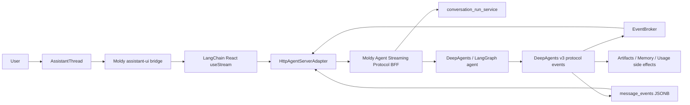

# Assistant UI LangGraph v3 Streaming Implementation Plan

> **For agentic workers:** REQUIRED SUB-SKILL: Use superpowers:subagent-driven-development (recommended) or superpowers:executing-plans to implement this plan task-by-task. Steps use checkbox (`- [ ]`) syntax for tracking.

**Goal:** Replace Moldy's message-only SSE chat runtime with a LangChain/LangGraph first-party stream runtime path that preserves DeepAgents v3 streaming semantics: message text, visible reasoning summaries, tool lifecycle, subagent activity, state updates, interrupts, checkpoints, artifacts, memory events, cancellation, and replay. Keep assistant-ui as the chat surface where it is valuable, but make LangGraph protocol state the source of truth.

**Architecture:** Keep DeepAgents and LangGraph as the backend runtime of record. Add Agent Streaming Protocol style command/subscription endpoints at the Moldy BFF boundary, expose preserved LangGraph protocol events through HTTP/SSE, and consume them from the frontend with a Moldy-owned `@langchain/react` v1 stream (`useStream`, `HttpAgentServerAdapter`, and scoped selector hooks). Bridge that single stream into assistant-ui through a local Moldy wrapper that reuses official assistant-ui conversion/runtime patterns where practical, instead of mounting `@assistant-ui/react-langchain` as-is or making `@assistant-ui/react-langgraph` the primary runtime. Upgrade DeepAgents to a version where `stream_events(version="v3")` works (`0.6.8` verified in the spike), use direct v3 as the primary backend source, and keep LangGraph `messages`/`updates`/`values`/`custom` stream modes as a fallback. Keep the current Moldy SSE runtime as a feature-flagged compatibility path until the LangGraph runtime reaches parity.

**Tech Stack:** FastAPI, SQLAlchemy async, LangChain 1.x, LangGraph 1.x, deepagents 0.6.x, LangGraph checkpointer Postgres, Next.js 16, React 19, assistant-ui, `@langchain/react`, `@langchain/langgraph-sdk`, `@langchain/core`, optional assistant-ui utility imports from `@assistant-ui/react-langchain` / `@assistant-ui/react-langgraph`, TanStack Query, Jotai, SSE.

---

## 1. Decision Summary

### Recommended path

Use **LangChain React stream runtime** as the primary agent state runtime:

- Frontend primary stream runtime: a Moldy-owned `@langchain/react` v1 `useStream` instance per conversation/thread.
- Frontend assistant-ui role: implement a local `MoldyLangGraphRuntimeProvider` / `useMoldyLangGraphStream` wrapper that feeds the same `@langchain/react` stream into assistant-ui through `useExternalStoreRuntime`. Reuse official `@assistant-ui/react-langchain` and `@assistant-ui/react-langgraph` converter/runtime patterns, but do not mount their full runtime hooks as the primary path.
- Frontend transport: prefer `HttpAgentServerAdapter` against Moldy BFF Agent Streaming Protocol endpoints.
- Backend primary projection: DeepAgents/LangGraph direct v3 via `agent.astream_events(..., version="v3")`, persisted as LangGraph protocol events with `method`, `params.namespace`, `params.data`, `seq`, and `event_id`.
- Backend fallback projection: LangGraph stream-mode events via `agent.astream(..., stream_mode=["messages", "updates", "values", "custom"], subgraphs=True)`.
- BFF responsibility: auth, ownership, conversation/run lifecycle, replay, artifact/memory side effects, and event normalization.
- Compatibility path: preserve existing Moldy SSE and AG-UI adapter until the new runtime has parity.
- Secondary option: `@assistant-ui/react-langgraph` remains a fallback adapter if the direct `@langchain/react` wrapper proves impossible, but it is not the preferred primary path because its message accumulator intentionally preserves namespaced subgraph tuple messages in the root message list, while Moldy needs root coordinator transcript and subagent transcripts separated by scoped selectors.

### Closed implementation decisions

These decisions close the remaining spike questions and should be treated as implementation requirements:

- **Default live stream channels:** subscribe to `messages`, `tools`, `updates`, `values`, `tasks`, `lifecycle`, `checkpoints`, and `custom` for the primary chat runtime. Include `values` by default because Moldy's UI depends on state-backed `todos`, interrupts, and checkpoint reconciliation. Do not assume Moldy-generated files are present in `values.files`; Moldy currently uses `FilesystemBackend(..., virtual_mode=True)`, so durable file/artifact UI must be artifact-first. Do not include `input` by default; reserve it for explicit debug/trace subscriptions.
- **State and history source:** use the LangGraph checkpointer as the canonical source for `GET state`, `POST state`, and `POST history`. Store canonical protocol events, `upstream_event_id`, `seq`, run ids, conversation ids, and checkpoint references in `message_events` for replay/debugging, but do not store full SDK state/history snapshots there as a second source of truth.
- **Namespace storage:** persist and route namespaces as `params.namespace: string[]`. If an assistant-ui `{ event, data }` view projection is needed, serialize namespaces with one helper using pipe suffixes and `encodeURIComponent` for each segment. Never use the serialized assistant-ui event name as the canonical replay/subagent-routing key.
- **Checkpoint resolution:** `getCheckpointId(threadId, parentMessages)` resolves the checkpoint attached to the last parent message. Use live LangGraph message metadata first, then persisted protocol/message checkpoint references, then `conversation.active_branch_checkpoint_id` only as a latest-turn fallback. Empty parent messages resolve to the initial/root checkpoint if one exists, otherwise `null`.
- **Reasoning display:** render only displayable reasoning/thinking blocks or adapter-marked summaries. Unknown provider reasoning payloads and private chain-of-thought must be redacted before they enter assistant-ui message parts. Tests must use both displayable and private reasoning fixtures.
- **Files/artifacts source:** use Moldy's existing `file_event` custom events plus `conversation_artifacts` / `artifact_versions` as the primary file surface. Treat `values.files` as an optional reconciliation source only when the runtime backend actually includes file state.
- **Cancel vs detach:** browser SSE disconnects must detach only and must never cancel the backend run. Explicit stop/cancel actions should route to the existing run cancel semantics, while `stop({ cancel: false })`-style disconnects keep the run alive for replay/reattach.
- **Values persistence:** stream `values` live for selectors, but persist only selected values snapshots or checkpoint references. Do not append every full `values` state snapshot into `message_events` for long conversations.
- **Multitask policy:** default `multitask_strategy` is `reject`, matching Moldy's current single-active-run UX. Add other strategies only behind explicit product decisions.
- **Draft conversations:** create the conversation through Moldy's existing REST path first, bind the returned `conversation_id` as the LangGraph `thread_id`, then use the normal conversation-scoped protocol paths. Do not require the browser to invent or pass a draft `thread_id` path segment before the DB-owned conversation exists.
- **Usage accounting split:** preserve two separate usage paths. UI token/cost display must still hydrate from final message metadata or an equivalent protocol usage event, while backend spend accounting must still flow through `SpendHook` / `spend_queue`; do not assume `save_token_usage` alone covers aggregate spend.
- **Shared-page traces:** public share rendering currently uses `frontend/src/lib/types/share.ts` `TurnTrace.events`, `frontend/src/lib/share/extract-chips.ts`, and `frontend/src/app/shared/[shareId]/page.tsx`. New canonical protocol events must either be projected into the legacy trace-chip shape or `extract-chips.ts` must learn the protocol event shape so shared tool/subagent chips do not disappear.

### Spike result: 2026-06-13

See `docs/design-docs/assistant-ui-langgraph-runtime-spike.md`.

Key decisions from the spike:

- `@assistant-ui/react-langgraph@0.14.7` expects an async stream of `{ event: string, data: unknown }`.
- Namespaced subgraph events are represented by a pipe suffix, such as `messages|tools:tc-1`.
- The official adapter already handles `messages`, `updates`, `values`, `custom`, `metadata`, `info`, `error`, interrupts, UI messages, per-message metadata, cancellation, and checkpoint lookup hooks.
- DeepAgents `stream_events(version="v3")` failed with `deepagents==0.6.1` because LangChain and DeepAgents both registered a `subagents` stream projection.
- Rechecking `deepagents==0.6.8` resolved that duplicate transformer issue; direct `stream_events(version="v3")` opened successfully and emitted v3 protocol events.
- DeepAgents `stream(..., stream_mode=["messages", "updates", "values", "custom"], subgraphs=True)` also worked and remains the fallback path.

### Local source review result: 2026-06-13

Additional local repositories were reviewed:

- `/Users/chester/dev/langgraph`
- `/Users/chester/dev/deepagents`
- `/Users/chester/dev/langgraphjs`
- `/Users/chester/dev/streaming-cookbook`
- `/Users/chester/dev/deep-agents-ui`
- `/Users/chester/dev/assistant-ui`

Key impact on this plan:

- No assistant-ui sample exists in `/Users/chester/dev/langgraph` or `/Users/chester/dev/deepagents`; `langgraph/libs/sdk-js/README.md` points JS SDK source to the separate `langgraphjs` repository.
- `/Users/chester/dev/langgraphjs/examples/assistant-ui-claude` does contain an assistant-ui sample. It uses `@langchain/react` `useStream` for LangGraph state, converts LangChain messages/tool calls/reasoning to assistant-ui `ThreadMessageLike`, and passes them into assistant-ui via `useExternalStoreRuntime`. It does not use `@assistant-ui/react-langgraph`.
- `/Users/chester/dev/langgraphjs/libs/sdk-react` is the strongest local frontend reference. It publishes `@langchain/react@1.0.22` and documents a v1 runtime built around root `useStream` plus companion selector hooks.
- `@langchain/react` exposes root projections (`values`, `messages`, `toolCalls`, `interrupts`, `isLoading`, `error`, `threadId`, `subagents`, `subgraphs`, `subgraphsByNode`) and scoped selectors (`useMessages`, `useToolCalls`, `useValues`, `useChannel`, `useChannelEffect`, `useExtension`, `useMessageMetadata`, `useSubmissionQueue`, media selectors).
- `langgraphjs/examples/ui-react/src/views/DeepAgentView.tsx` is the best product UI reference: render coordinator messages from `stream.messages`, discover specialists from `stream.subagents`, and only call `useMessages(stream, subagent)` / `useToolCalls(stream, subagent)` when a subagent card is expanded.
- `langgraphjs/libs/sdk-react/src/tests/stream.subscriptions.test.tsx` verifies the frontend scalability contract: root reads are free, scoped subagent subscriptions are ref-counted by `(selector, namespace)`, namespaces are isolated, and unmounting releases subscriptions.
- `langgraphjs/libs/sdk-react/docs/transports.md` recommends `HttpAgentServerAdapter` for production custom backends that can expose Agent Streaming Protocol style `commands` and `stream` endpoints. Moldy should prefer this over writing a custom browser adapter.
- `langgraph_sdk._async.stream.AsyncThreadStream` is a strong reference implementation for Moldy's BFF stream shape. It treats raw v3 channels as `values`, `updates`, `messages`, `tools`, `lifecycle`, `input`, `checkpoints`, `tasks`, and `custom`.
- Raw v3 events include upstream `event_id` in addition to `seq`; Moldy should persist both when available.
- Current LangGraph SDK tests treat `subagents` as an alias for `subgraphs` until the protocol distinguishes them. Moldy's product model should still call these Deep Agents subagents, but the backend adapter must accept `tasks`/`subgraphs` wire data.
- DeepAgents local tests verify real `create_deep_agent().astream_events(..., version="v3")` behavior with subagent handles, tool-call causes, scoped messages/tool calls, output, completed/failed statuses, and concurrent consumption.
- Inline DeepAgents subagents and `AsyncSubAgentMiddleware` background tasks are different runtime concepts. The UI should render both, but not pretend the async background task tools are the same as v3 inline subagent stream handles.
- `/Users/chester/dev/streaming-cookbook` confirms the same primary direction: large interactive apps should consume typed Agent Streaming Protocol events and SDK projections instead of low-level `stream_mode` tuples or a Moldy-only SSE protocol.
- The cookbook custom backend examples are the closest local implementation template for Moldy's BFF. They expose `POST /threads/:thread_id/commands`, `POST /threads/:thread_id/stream`, `GET|POST /threads/:thread_id/state`, and `POST /threads/:thread_id/history` for `HttpAgentServerAdapter` and LangGraph SDK hydration/history APIs.
- `python/react-custom-backend/src/app/session.py` is especially relevant to Moldy because it adapts Python v3 events for a JS frontend: buffer events by `seq`, replay before live delivery, filter by `channels`/`namespaces`/`depth`/`since`, mirror `event_id` or `seq` into SSE `id:`, normalize unknown channels to `custom`, and sanitize LangChain messages/commands/sends into JSON.
- The same Python custom backend unwraps Python v3 `(payload, metadata)` tuples for `messages` and `tools` because the JS message/tool assemblers expect the payload object. Moldy's BFF adapter must include this tuple-unwrapping behavior and regression tests.
- The Python custom backend also synthesizes `tools` channel lifecycle events from root `values.messages` when the Python runtime surfaces tool calls/results only inside message snapshots. Moldy should prefer raw `tools` events when present, but include this deduplicated synthesis fallback so tool-running UI remains reliable across Python runtime versions.
- The TypeScript custom backend uses `StreamChannel.local<ProtocolEvent>()` and the shared `matchesSubscription` predicate from `@langchain/langgraph/stream`. If Moldy cannot reuse that exact JS helper on the backend, backend tests must mirror its channel/namespace/depth/since semantics.
- The cookbook reconnect example persists a per-tab thread id and uses `useMessages(stream)` for token-level message projection. Moldy should use its DB-owned `conversation_id`/LangGraph `thread_id` mapping rather than browser-generated threads, but the E2E suite should copy the refresh-mid-stream and no-duplicate-replay behavior.
- The cookbook subagent examples confirm the UI projection split: use root messages for coordinator text, `thread.subagents`/`run.subagents` for discovery/status, and scoped `sub.messages` plus `sub.toolCalls` only when detail is needed.
- The cookbook custom transformer examples show the right place for Moldy-specific trace/artifact/memory/activity extensions: keep core protocol channels intact and emit domain events through `custom` or `custom:{name}` channels, where SDK extension handles can buffer and replay them.
- `/Users/chester/dev/deep-agents-ui` is not assistant-ui based and uses the older `@langchain/langgraph-sdk/react` stream hook, so it should not change the chosen runtime stack. It is still a useful DeepAgents product UI reference for state-backed `todos` and `files`.
- `deep-agents-ui/src/app/hooks/useChat.ts` reads `stream.values.todos`, `stream.values.files`, `stream.values.ui`, `stream.messages`, `stream.interrupt`, and `stream.getMessagesMetadata`. This reinforces that DeepAgents state panels should be derived from LangGraph state, not reconstructed from chat text.
- The same hook enables `reconnectOnMount`, `fetchStateHistory`, `threadId` in query state, optimistic user messages, `stream.stop()`, `command.resume`, checkpoint-based single-step reruns, and `client.threads.updateState(threadId, { values: { files } })` for file editing.
- `deep-agents-ui/src/app/components/ChatInterface.tsx` places a compact tasks/files meta panel directly above the composer: collapsed state shows the active task or all-complete summary plus file count; expanded state shows grouped todos and file cards. This is a good reference for Moldy's activity strip and artifact panel ergonomics.
- `deep-agents-ui/src/app/components/TasksFilesSidebar.tsx` auto-expands tasks/files only when they first appear, groups todos by `pending` / `in_progress` / `completed`, and disables file editing while a run is loading or interrupted.
- `deep-agents-ui/src/app/components/FileViewDialog.tsx` gives a practical file UX: preview Markdown as Markdown, preview code with syntax highlighting, copy/download actions, and edit/save through graph state. Moldy should adapt this to its artifact/version model instead of treating generated files only as transient stream events.
- `deep-agents-ui/src/app/components/ChatMessage.tsx` still detects subagents by the `task` tool's `subagent_type`; this is useful as a compatibility fallback, but Moldy's primary v3 UI should continue to prefer `stream.subagents` / scoped selectors when available.
- `deep-agents-ui/src/app/components/ToolCallBox.tsx` shows two useful auxiliary patterns: render LangGraph UI messages via `LoadExternalComponent`, and render HITL approval/edit/reject controls inline with the tool call.
- `/Users/chester/dev/assistant-ui/packages/react-langchain` is the closest assistant-ui-native match for the chosen upstream runtime. It implements `useStreamRuntime` by calling `@langchain/react` `useStream`, converting LangChain messages through `convertLangChainBaseMessage`, and feeding assistant-ui through `useExternalStoreRuntime`.
- `@assistant-ui/react-langchain@0.0.13` exports `useStreamRuntime`, `useLangChainState`, `useLangChainInterruptState`, `useLangChainSubmit`, `useLangChainSend`, `useLangChainSendCommand`, and `convertLangChainBaseMessage`.
- `useLangChainState<T>(key, defaultValue?)` reads arbitrary graph state from runtime extras (`stream.values[key]`). This directly covers DeepAgents `state.todos` and `state.files` panels without reconstructing tool-call streams.
- `useStreamRuntime` accepts upstream `UseStreamOptions`, so Moldy should be able to pass the same `HttpAgentServerAdapter`/transport options planned for `@langchain/react`, plus assistant-ui adapters.
- `react-langchain` already handles root messages, tool-call conversion, tool result submission, interrupt state, raw state submit/resume, cloud/custom thread list adapters, auto-cancelling pending tool calls, and `stream.stop()` cancellation wiring.
- The official docs compare `react-langchain` with `react-langgraph`: `react-langchain` is newer and thinner, but currently does not expose subgraph/namespaced stream events, generative UI messages, per-message metadata, or the broader `react-langgraph` event handler surface.
- `examples/with-langchain` demonstrates the target shape for simple apps: `useStreamRuntime(...)` in a runtime provider and `useLangChainState<Todo[]>("todos", [])` in a side panel. For Moldy, it is a useful lightweight reference, but the full hook should not be mounted as-is because it hides the underlying `@langchain/react` stream needed by subagent selectors.
- `/Users/chester/dev/assistant-ui/packages/react-langgraph` is also official source, and it is the fuller assistant-ui LangGraph adapter. It exposes `useLangGraphRuntime`, `useLangGraphMessages`, `LangGraphMessageAccumulator`, `convertLangChainMessages`, `useLangGraphMessageMetadata`, `useLangGraphUIMessages`, event handlers, checkpoint-aware edit/regenerate, cancellation, and generative UI support.
- The `react-langgraph` source is not the best primary runtime for Moldy's DeepAgents UI because `useLangGraphMessages` accumulates namespaced `messages|...` subgraph tuple events into the same root message list, preserving tuple-only subgraph messages through final `values` reconciliation. That is useful for generic LangGraph assistant-ui behavior, but Moldy needs coordinator messages in the root transcript and subagent messages/tool calls rendered lazily in subagent cards or panels.
- Final frontend adapter decision: use direct `@langchain/react` as the stream owner, build a local single-stream Moldy wrapper for assistant-ui, reuse `react-langchain` for lightweight conversion/submission patterns, and reuse `react-langgraph` as a reference or utility source for message accumulation, metadata, UI messages, and checkpoint behavior. Do not fork either assistant-ui package at the start.
- `@assistant-ui/react` helper exports must be verified against the installed version before use. In particular, do not assume `makeAssistantDataUI` is exported; if it is absent, implement reasoning rendering through the installed message part/data renderer extension point and record the fallback in this plan.

### BFF position: production boundary, not semantic translation layer

Moldy should keep a backend boundary between the browser and the agent runtime. This is not an accidental preference caused by prior discussion of "BFF"; it follows from Moldy's product architecture:

- Auth is enforced by FastAPI using HttpOnly cookies, CSRF, and user ownership checks.
- Agents, conversations, credentials, MCP tools, memory, artifacts, audit logs, usage accounting, and run lifecycle are all Moldy backend concepts.
- DeepAgents/LangGraph currently run inside the FastAPI backend, not in a separately exposed LangGraph Platform service.
- Conversation run attach/replay/cancel/stale behavior is already implemented in Moldy's backend.

The stable production shape is therefore:

```text
Frontend assistant-ui
  -> Moldy BFF
    -> DeepAgents / LangGraph runtime
```

The BFF must be **thin and contract-preserving**. It exists to enforce product boundaries and expose the official runtime contract safely; it must not become a second chat protocol that flattens LangGraph semantics.

BFF should do:

- authenticate the user and verify agent/conversation ownership,
- map Moldy `agent_id`, `conversation_id`, and `run_id` to LangGraph `thread_id` / run config,
- resolve credentials and runtime configuration server-side,
- persist artifacts, memory events, usage, audit records, and trace events,
- support attach/replay/cancel/stale lifecycle,
- expose stream/state shapes that `@langchain/react` can consume with minimal adaptation, with optional assistant-ui projection derived from the same protocol events.

BFF should not do:

- collapse LangGraph events into `content_delta` and `tool_call_start` as the primary path,
- flatten subagents into a single `task` tool event when namespace/subagent events are available,
- route Moldy's primary frontend through AG-UI and then convert back into Moldy event shapes,
- rebuild assistant-ui message state by hand when the official LangGraph runtime can own it,
- infer planning/thinking states from natural-language text.

Direct browser-to-LangGraph is acceptable for a small demo or for a deployment where LangGraph Platform owns auth, thread storage, run lifecycle, and state. That is not Moldy's current architecture. For Moldy, the orthodox implementation is **BFF present, protocol thin, semantics preserved**.

### Why not keep current `useExternalStoreRuntime`

Current Moldy chat rendering is built around `useExternalStoreRuntime` in `frontend/src/lib/chat/use-chat-runtime.ts`. This is a valid assistant-ui custom backend path, but it leaves Moldy responsible for reconstructing every runtime concept from low-level events. Today it only consumes flat Moldy events: `content_delta`, `tool_call_start`, `tool_call_result`, `file_event`, `memory_*`, `interrupt`, `message_end`, `stale`.

That shape cannot natively represent:

- reasoning/thinking blocks,
- tool args streaming vs tool execution vs tool result,
- subagent namespaces and nested messages,
- `updates`/`values` state changes such as `todos`,
- checkpoint creation and branch lineage,
- lifecycle events like run queued/running/interrupted/cancelled/finished,
- custom UI messages.

### Why not make AG-UI the primary Moldy frontend runtime

assistant-ui has a proper AG-UI runtime (`@assistant-ui/react-ag-ui`) that supports thinking/reasoning/tool/state events. Moldy does not currently use it. The current code converts Moldy SSE to AG-UI on the backend and converts AG-UI back to Moldy SSE on the frontend:

- Backend adapter: `backend/app/agent_runtime/ag_ui_adapter.py`
- Frontend adapter: `frontend/src/lib/ag-ui/chat-run-consumer.ts`

That double conversion discards much of the semantic value. AG-UI should remain useful as an external integration protocol, but Moldy's own frontend is more deeply coupled to LangGraph features: checkpointer state, branch checkpoint ids, DeepAgents subagents, HITL interrupts, generated artifacts, and debug traces.

### How assistant-ui and `@langchain/react` should fit together

LangChain's Deep Agents frontend docs and local `langgraphjs` examples show a direct `@langchain/react` `useStream` pattern for Deep Agents. That pattern should become Moldy's stream-state model:

- root `stream.messages` renders coordinator messages;
- `stream.subagents` exposes subagent discovery snapshots;
- selector hooks such as `useMessages(stream, subagent)` and `useToolCalls(stream, subagent)` subscribe to a subagent's scoped output only when its card is mounted;
- subagent cards are indexed by the tool-call id that spawned them and attached below the coordinator AI message.

Moldy should not throw away the whole assistant-ui surface in this migration because the product already relies on assistant-ui for composer/thread primitives, tool UI registration, HITL approval cards, feedback, attachments, artifacts, edit/regenerate, and existing accessibility/layout behavior.

The recommended composition is:

- use `@langchain/react` as the canonical stream runtime;
- introduce a Moldy runtime provider/wrapper that owns exactly one `@langchain/react` stream per conversation and shares that same stream with both assistant-ui and DeepAgents-specific panels;
- feed assistant-ui from that stream through a local `useExternalStoreRuntime` bridge, borrowing the small `react-langchain` conversion/submission pattern instead of mounting `useStreamRuntime` as-is;
- expose the Moldy BFF through `HttpAgentServerAdapter` where practical;
- use `@langchain/react` selectors directly for DeepAgents v3 surfaces such as subagent scoped selectors, namespaced events, UI messages, message metadata, and artifact reconciliation;
- use assistant-ui for the polished chat surface, not as the semantic source of DeepAgents stream state;
- keep `@assistant-ui/react-langgraph` as a fallback/reference, not the primary adapter, because its full runtime accumulates namespaced subgraph tuple messages into the root assistant-ui message list.

Borrow the official Deep Agents frontend UI patterns:

- separate coordinator messages from specialist subagent work;
- treat `stream.subagents` as the user-facing subagent source, not raw `stream.subgraphs`;
- attach subagent cards under the coordinator tool call that spawned them;
- subscribe to scoped messages/tool calls lazily when a subagent card or side panel is open;
- auto-collapse completed subagent cards in large multi-worker flows;
- show per-subagent errors without failing the whole chat UI.

---

## 2. Official References

Use these references during implementation:

- LangChain Deep Agents v0.6 announcement: https://www.langchain.com/blog/deep-agents-0-6
- LangChain Agent Protocol and Agent Streaming Protocol overview: https://github.com/langchain-ai/agent-protocol
- LangGraph streaming docs: https://docs.langchain.com/oss/python/langgraph/streaming
- Deep Agents overview: https://docs.langchain.com/oss/python/deepagents/overview
- Deep Agents event streaming: https://docs.langchain.com/oss/python/deepagents/event-streaming
- Deep Agents frontend subagent streaming: https://docs.langchain.com/oss/python/deepagents/frontend/subagent-streaming
- LangChain frontend overview: https://docs.langchain.com/oss/python/langchain/frontend/overview
- assistant-ui LangGraph runtime: https://www.assistant-ui.com/docs/runtimes/langgraph
- assistant-ui ExternalStoreRuntime: https://www.assistant-ui.com/docs/runtimes/custom/external-store
- assistant-ui AG-UI runtime: https://www.assistant-ui.com/docs/runtimes/ag-ui/quickstart
- assistant-ui AG-UI runtime options: https://www.assistant-ui.com/docs/runtimes/ag-ui/runtime-options
- assistant-ui LangChain runtime comparison: https://www.assistant-ui.com/docs/runtimes/langchain
- Local source reference: `/Users/chester/dev/langgraphjs/libs/sdk-react/README.md`
- Local source reference: `/Users/chester/dev/langgraphjs/libs/sdk-react/docs/use-stream.md`
- Local source reference: `/Users/chester/dev/langgraphjs/libs/sdk-react/docs/subagents.md`
- Local source reference: `/Users/chester/dev/langgraphjs/libs/sdk-react/docs/transports.md`
- Local source reference: `/Users/chester/dev/langgraphjs/examples/ui-react/src/views/DeepAgentView.tsx`
- Local source reference: `/Users/chester/dev/langgraphjs/examples/assistant-ui-claude/src/components/my-assistant.tsx`
- Local source reference: `/Users/chester/dev/streaming-cookbook/README.md`
- Local source reference: `/Users/chester/dev/streaming-cookbook/python/react-custom-backend/src/app/session.py`
- Local source reference: `/Users/chester/dev/streaming-cookbook/python/react-custom-backend/src/app/server.py`
- Local source reference: `/Users/chester/dev/streaming-cookbook/typescript/react-custom-backend/src/server/session.ts`
- Local source reference: `/Users/chester/dev/streaming-cookbook/typescript/react-custom-backend/src/app/index.tsx`
- Local source reference: `/Users/chester/dev/streaming-cookbook/typescript/ui-react/src/reconnect.tsx`
- Local source reference: `/Users/chester/dev/streaming-cookbook/typescript/streaming/src/subagents/remote.ts`
- Local source reference: `/Users/chester/dev/streaming-cookbook/typescript/streaming/src/custom-transformer/remote.ts`
- Local source reference: `/Users/chester/dev/deep-agents-ui/src/app/hooks/useChat.ts`
- Local source reference: `/Users/chester/dev/deep-agents-ui/src/app/components/ChatInterface.tsx`
- Local source reference: `/Users/chester/dev/deep-agents-ui/src/app/components/TasksFilesSidebar.tsx`
- Local source reference: `/Users/chester/dev/deep-agents-ui/src/app/components/FileViewDialog.tsx`
- Local source reference: `/Users/chester/dev/deep-agents-ui/src/app/components/ToolCallBox.tsx`
- Local source reference: `/Users/chester/dev/assistant-ui/packages/react-langchain/src/useStreamRuntime.ts`
- Local source reference: `/Users/chester/dev/assistant-ui/packages/react-langchain/src/convertMessages.ts`
- Local source reference: `/Users/chester/dev/assistant-ui/packages/react-langchain/src/useLangChainState.test.tsx`
- Local source reference: `/Users/chester/dev/assistant-ui/packages/react-langgraph/src/useLangGraphRuntime.ts`
- Local source reference: `/Users/chester/dev/assistant-ui/packages/react-langgraph/src/useLangGraphMessages.ts`
- Local source reference: `/Users/chester/dev/assistant-ui/packages/react-langgraph/src/LangGraphMessageAccumulator.ts`
- Local source reference: `/Users/chester/dev/assistant-ui/packages/react-langgraph/src/convertLangChainMessages.ts`
- Local source reference: `/Users/chester/dev/assistant-ui/apps/docs/content/docs/runtimes/langchain.mdx`
- Local source reference: `/Users/chester/dev/assistant-ui/examples/with-langchain/app/MyRuntimeProvider.tsx`
- Local source reference: `/Users/chester/dev/assistant-ui/examples/with-langchain/components/TodosPanel.tsx`

Important official guidance to preserve:

- Deep Agents v0.6 streaming is centered on typed projections for messages, tool calls, subagents, state updates, custom channels, and final output.
- Deep Agents recommends `stream.subagents` for user-facing subagent UI because it exposes product-level delegated tasks, while `stream.subgraphs` exposes lower-level graph structure.
- Deep Agents frontend docs recommend coordinator messages at the root and subagent cards attached under the coordinator tool call that spawned them.
- Deep Agents subagent discovery snapshots do not contain streamed subagent messages/tool calls; those are scoped streams that should be subscribed to lazily when a subagent card/panel needs them.
- Deep Agents event streaming docs recommend raw v3 protocol iteration when exact arrival order across coordinator and subagents matters; use `params.namespace` and sequence/order metadata for source attribution.
- Deep Agents subagent projections expose `name`, `path`, `status`, scoped `messages`, scoped `tool_calls`, scoped `values`, nested `subagents`, and `output`; Moldy's adapter must preserve these concepts even if assistant-ui consumes some of them through custom handlers.
- Local LangGraph SDK source shows the raw protocol channel for tool-call streams as `tools`; the public projection is named `tool_calls`. Handle both names explicitly.
- Local LangGraph SDK source currently aliases `subagents` to `subgraphs`; DeepAgents semantics should drive the UI labels, while `tasks`/`subgraphs` wire metadata should remain accepted adapter input.
- Local LangGraph JS source shows `@langchain/react` v1 as the first-party React runtime for DeepAgents/LangGraph. It provides root projections, subagent discovery maps, scoped selector hooks, ref-counted subscriptions, raw channels, interrupts, message metadata, submission queues, and media selectors.
- Local LangGraph JS source recommends `HttpAgentServerAdapter` for a production custom backend that can expose Agent Streaming Protocol style command and stream endpoints.
- Local `examples/assistant-ui-claude` shows that assistant-ui can be used as the chat surface while `@langchain/react` owns LangGraph stream state.
- Local streaming-cookbook custom backend examples show the complete HTTP surface expected by the stock frontend runtime: `commands`, `stream`, `state`, and `history`. Implementing only `commands` and `stream` is not enough for stable hydration, checkpoint-aware reload, and history-aware UI operations.
- Local streaming-cookbook Python code shows that Python v3 message/tool events may need tuple unwrapping and tool-lifecycle synthesis before JS assemblers can consume them. Treat this as a backend adapter requirement, not a frontend workaround.
- Local streaming-cookbook examples show custom projections and Moldy domain activity should use `custom` / `custom:{name}` channels while preserving core `messages`, `tools`, `values`, `updates`, `tasks`, `lifecycle`, `input`, and `checkpoints` channels.
- Local deep-agents-ui source shows DeepAgents-specific `todos` and, when present, `files` can be first-class state panels. In Moldy, `todos` should drive planning/progress UI from `values.todos`, while file/artifact panels should be artifact-first because Moldy uses a filesystem backend; `values.files` is a reconciliation source only when populated by the runtime.
- Local deep-agents-ui source is a UI-pattern reference only. Do not copy its runtime wholesale because it is not assistant-ui based and uses older LangGraph SDK React APIs.
- Local assistant-ui source shows `@assistant-ui/react-langchain` is the official thin assistant-ui wrapper around `@langchain/react` `useStream`, but it hides the underlying stream object that Moldy needs for scoped DeepAgents selectors.
- Local assistant-ui source also confirms `react-langgraph` is the fuller assistant-ui LangGraph adapter, but its root message accumulator preserves namespaced subgraph tuple messages in the same message list. Moldy should use it as a reference/utility source, not as the primary runtime hook.
- LangGraph streaming supports `messages`, `updates`, `values`, and `custom` stream modes.
- assistant-ui's LangGraph adapter is the broader-feature adapter for LangGraph-specific needs: subgraph events, UI messages, message metadata, and end-to-end cancellation.
- assistant-ui's ExternalStoreRuntime is appropriate when the app owns a custom message store. Moldy currently does this, but the new requirement is to preserve agent runtime semantics, not only render messages.
- assistant-ui's AG-UI runtime supports thinking/reasoning blocks, tool events, state snapshots/deltas, cancellation, run resumption, and interrupts, but adopting it as primary would require mapping LangGraph-specific features into AG-UI custom events.

### Orthodox support principles

The stability target is not "more compatibility code." The target is to satisfy the official LangGraph and assistant-ui runtime contracts closely enough that the official adapter does most of the hard work.

Non-negotiable principles:

- **Use LangGraph runtime semantics, not only assistant-ui components.** The primary path must preserve Agent Streaming Protocol/LangGraph events for message streaming, run state, cancellation, interrupts, metadata, checkpoints, subagents, tools, and state updates. assistant-ui can render the surface, but Moldy must not make assistant-ui message mutation the source of truth.
- **Prefer `@langchain/react` for DeepAgents stream state.** The local first-party LangGraph JS code gives subagent discovery, scoped selector hooks, raw channels, interrupts, metadata, submission queues, and transport adapters to `@langchain/react`. Use that layer unless package verification proves `@assistant-ui/react-langgraph` can preserve the same DeepAgents semantics with less custom code.
- **Expose a LangGraph-shaped state.** The BFF state loader must return a graph state with a `messages` key because both LangGraph runtime selectors and assistant-ui bridges need messages to live in graph state. Moldy's DB `Message` rows are persistence records; they are not the runtime state contract by themselves.
- **Implement the full custom-backend protocol surface.** Moldy's BFF should expose endpoints compatible with `HttpAgentServerAdapter` and LangGraph SDK thread APIs: command handling for run start/resume/cancel/state, filtered stream subscriptions, thread state load/update, and thread history.
- **Preserve stable message ids.** Every assistant, user, tool, and data part must have stable ids across live stream, replay, refresh, edit, and regenerate. Do not generate fresh client ids during replay for persisted runtime messages.
- **Prefer official LangGraph selectors and assemblers.** Use `@langchain/react` root projections and selector hooks for messages, tool calls, values, interrupts, subagents, raw channels, and metadata. Use assistant-ui converters only for the assistant-ui surface bridge.
- **Own one stream in Moldy.** The primary frontend path should call `@langchain/react useStream` once in a Moldy provider and share that stream with assistant-ui and DeepAgents panels. Do not mount `@assistant-ui/react-langchain useStreamRuntime` as-is if it hides the stream object needed by scoped selectors.
- **Reuse official assistant-ui source patterns, not package internals.** Borrow/import stable converters and mirror the small `react-langchain` `useExternalStoreRuntime` bridge where useful. Use `react-langgraph` as the reference for message accumulation, metadata, UI messages, cancellation, and checkpoint behavior. Avoid forking either package unless a package-level bug blocks the local wrapper.
- **Keep BFF adaptation narrow.** The backend may adapt auth, ownership, run lifecycle, credential resolution, artifact persistence, memory persistence, usage accounting, and replay to Moldy's data model, but it should not invent a second chat protocol for the primary path. The primary stream must be as close as possible to Agent Streaming Protocol events.
- **Do not reconstruct planning from text.** Planning must come from `updates`/`values` state such as `todos`, DeepAgents planning tools, or explicit custom events. UI labels like "계획을 세우는 중" should be derived from state/tool lifecycle, not guessed from model text.
- **Treat DeepAgents `todos` as a state surface and files as artifact-first.** `todos` belongs in planning/progress UI from LangGraph `values.todos`. Files belong in Moldy's artifact/file panel primarily from `file_event`, `conversation_artifacts`, and `artifact_versions`; reconcile `values.files` only when the actual runtime state provides it.
- **Do not flatten subagents into tools in the primary runtime.** A `task` tool can still render for compatibility, but the v3 path should preserve namespace/subagent identity so nested activity and subagent messages can be rendered.
- **Use `stream.subagents` for user-facing subagent identity.** `stream.subgraphs` can remain useful for debugging, but the Moldy UI should display Deep Agents task delegations: subagent name, path, status, tool-call cause, messages, tool calls, output, and errors.
- **Attach subagent UI to the spawning tool call.** Index subagent snapshots by the coordinator tool-call id so subagent cards appear under the assistant turn that delegated the work.
- **Subscribe to scoped subagent details lazily.** The main thread should not eagerly render every nested transcript. Load/render subagent messages and tool calls when a subagent card is expanded or the right rail subagent panel is open.
- **Preserve protocol order separately from detail selectors.** Use raw v3 event order for live/replay ordering and debugging. Use scoped subagent selectors or derived state for expandable detail surfaces, not as the only source of chronological stream truth.
- **Render only displayable reasoning.** The official runtime can carry thinking/reasoning blocks, but Moldy must still enforce a displayability rule. Private chain-of-thought never becomes a UI part.
- **Treat replay as the same protocol.** Live stream, GET attach, DB replay, and refresh must all return the same semantic event/message shape. Replay must not fall back to legacy Moldy SSE for the new runtime.
- **Make AG-UI external, not internal.** AG-UI remains a useful standard integration, but Moldy's main frontend should not route DeepAgents/LangGraph streaming through AG-UI and then back into Moldy event shapes.
- **Use assistant-ui as the surface deliberately.** `useExternalStoreRuntime` is acceptable in the new path only as a bridge from `@langchain/react` state into assistant-ui primitives, not as a Moldy SSE event reducer.

---

## 3. Current Source Baseline

### Backend

Current stream source:

- `backend/app/agent_runtime/streaming.py`
  - Uses `agent.astream(input, config=config, stream_mode="messages")`.
  - Emits Moldy SSE strings with `format_sse`.
  - Detects text deltas, tool call starts, tool results, artifact events, memory events, interrupts, final usage.

Current runner:

- `backend/app/agent_runtime/agent_stream_runner.py`
  - Prepares agent through `_prepare_agent`.
  - Delegates streaming to `stream_agent_response`.
  - Feeds broker, trace sink, persistence callback, run id, artifact recorder.

Current replay and attach:

- `backend/app/agent_runtime/event_broker.py`
  - Per-run in-memory ring buffer.
  - Supports `subscribe(after_id)`, dedup by event id, and close.
- `backend/app/services/conversation_stream_service.py`
  - Builds `StreamCtx`.
  - Provides `build_persist_callback`.
  - Stores partial event chunks through `trace_storage.append_events`.
  - Adds `X-Run-Id`.
- `backend/app/routers/conversation_runs.py`
  - GET `/api/conversations/{conversation_id}/runs/{run_id}/stream`.
  - Attaches to live broker, DB replay, or stale marker.
- `backend/app/routers/conversation_ag_ui.py`
  - GET `/api/conversations/{conversation_id}/runs/{run_id}/ag-ui-stream`.
  - Converts stored Moldy events to AG-UI events.

Current AG-UI implementation:

- `backend/app/agent_runtime/ag_ui_adapter.py`
  - Converts Moldy events to AG-UI events.
  - Does not originate from LangGraph stream events.

### Frontend

Current runtime:

- `frontend/src/lib/chat/use-chat-runtime.ts`
  - Uses `useExternalStoreRuntime`.
  - Mutates `streamingMessages` from Moldy SSE events.
  - Converts backend `Message` objects via `useExternalMessageConverter`.

Current stream readers:

- `frontend/src/lib/sse/stream-chat.ts`
  - POST `/api/conversations/{conversation_id}/messages`.
  - POST `/api/agents/{agent_id}/conversations/start`.
  - Reads Moldy SSE.
- `frontend/src/lib/sse/parse-sse.ts`
  - Uses `fetchEventSource` for POST.
  - Uses native `fetch` for GET resume.
  - Tracks `X-Run-Id`, `X-Conversation-Id`, `Last-Event-ID`.
- `frontend/src/lib/sse/stream-resume-attach.ts`
  - Feature flag `NEXT_PUBLIC_CHAT_STREAM_PROTOCOL=ag_ui` only affects GET attach.

Current page integration:

- `frontend/src/app/agents/[agentId]/conversations/[conversationId]/page.tsx`
  - Creates `streamFn`.
  - Calls `useChatRuntime`.
  - Wraps `AssistantThread` with `AssistantRuntimeProvider`.
  - Registers `ALL_TOOL_UI`.

Current UI affordances:

- `frontend/src/components/chat/witty-loading.tsx`
  - Generic randomized loading text, not runtime-aware.
- `frontend/src/components/chat/tool-ui/collapsible-pill.tsx`
  - Supports `kind: "tool" | "subagent" | "thinking"`, but `thinking` is not wired to stream events.
- `frontend/src/components/chat/tool-ui/phase-timeline-ui.tsx`
  - Good builder-specific planning card for `phase_timeline`, not a general runtime activity model.
- `frontend/src/components/chat/tool-ui/sub-agent-ui.tsx`
  - Treats DeepAgents `task` as a tool call, not a nested live subagent stream.

### Dependencies

Backend should update the DeepAgents floor before direct v3 implementation:

- Current: `deepagents>=0.6.1,<0.7.0`
- Recommended: `deepagents>=0.6.8,<0.7.0`
- `langchain>=1.0,<2.0`
- `langchain-core>=1.0,<2.0`
- `langgraph>=1.0,<2.0`
- `langgraph-checkpoint-postgres>=3.0,<4.0`

Important spike result: `deepagents==0.6.1` failed direct v3 with a duplicate `SubagentTransformer` projection, but `deepagents==0.6.8` resolved that failure in isolated verification. The implementation must lock or floor the backend dependency so CI cannot resolve back to a broken `0.6.1`-style graph.

Frontend is missing the recommended LangChain React runtime packages:

- Present: `@assistant-ui/react@^0.12.24`, `@assistant-ui/react-streamdown@^0.1.9`
- Recommended LangGraph runtime target from local `langgraphjs`: `@langchain/react@1.0.22`, `@langchain/langgraph-sdk@1.9.21`, `@langchain/core@^1.1.48`
- Assistant-ui source references from local `assistant-ui`: `@assistant-ui/react-langchain@0.0.13` with peer `@langchain/react@^1.0.2`, and `@assistant-ui/react-langgraph@0.14.7` with peer `@langchain/langgraph-sdk@^1.8.0`
- Optional assistant-ui package target observed in the earlier package spike: `@assistant-ui/react@0.14.18`, `@assistant-ui/react-streamdown@0.3.3`

Implementation should first add `@langchain/react`, `@langchain/langgraph-sdk`, and `@langchain/core`. Add `@assistant-ui/react-langchain` and/or `@assistant-ui/react-langgraph` only for stable exported utilities that the local Moldy wrapper imports, such as message converters. Upgrade assistant-ui packages if those exports require the newer peer set. Do not make either assistant-ui package's full runtime hook the primary runtime without an explicit plan update.

---

## 4. Target Architecture



### Runtime split

Add two frontend runtimes during migration:

| Runtime | Hook | Protocol | Purpose |
|---|---|---|---|
| Legacy | `useChatRuntime` | Moldy SSE | Current stable path |
| New | `useMoldyLangGraphStream` + assistant-ui bridge | Agent Streaming Protocol events through `@langchain/react` | Primary target |
| Optional | `useMoldyAssistantLangGraphRuntime` | assistant-ui LangGraph `{ event, data }` projection | Secondary adapter if needed |

Feature flag:

```dotenv
NEXT_PUBLIC_CHAT_RUNTIME=legacy
# or
NEXT_PUBLIC_CHAT_RUNTIME=langgraph_v3
```

Do not use `NEXT_PUBLIC_CHAT_STREAM_PROTOCOL=ag_ui` for the new primary path. That flag only controls current GET attach conversion and should be retired after migration.

### Backend stream contract

Add an Agent Streaming Protocol compatible event shape as the canonical persisted/live stream. The frontend should consume it through `@langchain/react` and `HttpAgentServerAdapter` where practical. The backend may keep Moldy-specific `id`, `run_id`, `thread_id`, and timestamps as persistence metadata.

```python
class StoredProtocolEvent(TypedDict):
    id: str
    upstream_event_id: str | None
    seq: int | None
    method: str
    namespace: list[str]
    data: JsonValue
    conversation_id: str
    run_id: str
    thread_id: str
    checkpoint_id: str | None
    checkpoint_ns: str | None
    timestamp: str | None
```

`message_events` persistence should retain the event log and checkpoint references needed for live replay, debugging, and display reconciliation. It should not store full SDK `ThreadState` history snapshots as a competing state store. State and history endpoints must use LangGraph checkpointer APIs when a checkpoint exists.

For `HttpAgentServerAdapter` and LangGraph SDK thread APIs, expose these endpoint families:

```typescript
type CommandEndpoint = 'POST /api/conversations/{conversationId}/langgraph/threads/{threadId}/commands'
type StreamEndpoint = 'POST /api/conversations/{conversationId}/langgraph/threads/{threadId}/stream/events'
type GetStateEndpoint = 'GET /api/conversations/{conversationId}/langgraph/threads/{threadId}/state'
type UpdateStateEndpoint = 'POST /api/conversations/{conversationId}/langgraph/threads/{threadId}/state'
type HistoryEndpoint = 'POST /api/conversations/{conversationId}/langgraph/threads/{threadId}/history'
```

The commands endpoint accepts the official Agent Protocol `Command` envelope. Moldy must support at least `run.start`; cancellation may be implemented as an adapter-supported command or as the SDK transport's abort/stop behavior, but it must not be modeled as a Moldy-only stream event.

```typescript
type AgentProtocolCommand = {
  id: string
  method: 'run.start'
  params?: {
    input?: Record<string, unknown>
    config?: {
      configurable?: {
        thread_id?: string
        checkpoint_id?: string
        checkpoint_ns?: string
      }
      metadata?: Record<string, unknown>
    }
    metadata?: Record<string, unknown>
    multitask_strategy?: 'reject' | 'interrupt' | 'rollback' | 'enqueue'
    checkpoint?: ThreadCheckpoint
    attachments?: string[]
  }
}

type AgentProtocolCommandResponse =
  | { type: 'success'; id: string; result: { run_id: string } }
  | { type: 'error'; id: string; error: string; message: string }

type ThreadCheckpoint = {
  thread_id?: string
  checkpoint_id: string
  checkpoint_ns?: string
}
```

For new messages, `params.input` contains graph input such as `{ messages: [...] }`. For interrupt resume, the frontend should use the installed `@langchain/react` submit/respond command APIs so the SDK-provided resume command is carried inside the `run.start` input/config shape. The BFF should pass that through to LangGraph rather than inventing a separate Moldy resume payload.

The stream endpoint receives `SubscribeParams` and returns filtered SSE protocol events:

```typescript
type SubscribeParams = {
  channels?: Array<'messages' | 'tools' | 'updates' | 'values' | 'tasks' | 'lifecycle' | 'checkpoints' | 'custom' | 'input' | `custom:${string}`>
  namespaces?: string[][]
  depth?: number
  since?: number
}
```

Default primary-chat subscription:

```json
{
  "channels": ["messages", "tools", "updates", "values", "tasks", "lifecycle", "checkpoints", "custom"],
  "depth": 0
}
```

Scoped subagent detail subscriptions must pass the subagent namespace and a depth appropriate for the expanded card/panel. Do not include `input` in the default UI subscription; allow it only for explicit debug/trace views.

State and history routes use SDK-compatible wire shapes:

```typescript
type ThreadState = {
  values: Record<string, unknown>
  next: string[]
  tasks: Array<{
    id?: string
    name?: string
    error: unknown | null
    interrupts: unknown[]
    state: unknown | null
  }>
  checkpoint: {
    thread_id: string
    checkpoint_id: string | null
    checkpoint_ns: string
  }
  metadata: Record<string, unknown>
  created_at: string | null
  parent_checkpoint: ThreadCheckpoint | null
}

type UpdateStateRequest = {
  values?: Record<string, unknown> | null
  checkpoint?: ThreadCheckpoint | null
  as_node?: string
}

type HistoryRequest = {
  limit?: number
  before?: string | ThreadCheckpoint
}

type HistoryResponse = ThreadState[]
```

If an assistant-ui LangGraph `{ event, data }` view adapter is still needed, derive it from canonical protocol events. Python LangGraph stream-mode fallback chunks with `subgraphs=True` may arrive as `(namespace, mode, data)`. Convert them as:

```python
from urllib.parse import quote


def format_assistant_ui_event_name(mode: str, namespace: list[str]) -> str:
    if not namespace:
        return mode
    encoded = "|".join(quote(segment, safe="") for segment in namespace)
    return f"{mode}|{encoded}"
```

Do not store only this assistant-ui projection. Store canonical protocol fields in `message_events.events`, including the original namespace array. The old Moldy SSE event format and assistant-ui `{ event, data }` format can be derived from it for legacy/view clients, not the other way around.

For direct v3 protocol events, persist these upstream fields whenever present:

- `event_id`: server-side protocol cursor/id; store as `upstream_event_id`;
- `seq`: monotonic raw stream order;
- `params.namespace`: source scope for root/subagent routing;
- `method`: raw channel name such as `messages`, `tools`, `tasks`, `lifecycle`, `values`, `updates`, `input`, `checkpoints`, or `custom`.

Backend adapter requirements from the local streaming-cookbook:

- Encode SSE as `event: message` with the full protocol event JSON in `data:` and `id:` set to upstream `event_id` when present, falling back to `seq`.
- Replay buffered/stored events matching `SubscribeParams` before live events, using the same channel/namespace/depth/since filter for both replay and live delivery.
- Normalize unknown methods to the `custom` envelope without dropping payloads.
- Preserve `custom:{name}` subscription semantics for domain extensions such as artifacts, memory, trace, A2A, or tool-activity projections.
- Sanitize LangChain `BaseMessage`, `Command`, `Send`, dataclasses, tuples, and message chunks into JSON before persistence or SSE.
- Unwrap Python v3 `(payload, metadata)` tuples for `messages` and `tools` so JS protocol assemblers receive the expected payload object while metadata remains available.
- Prefer raw `tools` events when emitted. If Python v3 only exposes tool calls/results through root `values.messages`, synthesize deduplicated `tool-started` and `tool-finished` events from AI `tool_calls` and `ToolMessage` snapshots.
- Serialize thread state in the shape expected by LangGraph SDK clients: `values`, `next`, `tasks`, `checkpoint`, `metadata`, `created_at`, and `parent_checkpoint` where available.

### Frontend activity model

Add a separate activity model instead of relying on message text status:

```typescript
export type RunActivityKind =
  | 'thinking'
  | 'planning'
  | 'tool'
  | 'subagent'
  | 'background_subagent'
  | 'artifact'
  | 'memory'
  | 'interrupt'
  | 'checkpoint'
  | 'responding'
  | 'reconnecting'
  | 'done'
  | 'error'

export type RunActivityStatus =
  | 'pending'
  | 'running'
  | 'requires_action'
  | 'complete'
  | 'error'
  | 'cancelled'

export interface RunActivity {
  id: string
  runId: string
  kind: RunActivityKind
  status: RunActivityStatus
  title: string
  subtitle?: string
  namespace: string[]
  startedAt?: string
  endedAt?: string
  toolCallId?: string
  parentId?: string
  data?: Record<string, unknown>
}
```

Render this as a compact "agent activity strip" near the active assistant message. `WittyLoadingMessage` becomes a fallback only when no semantic activity exists.

### Reasoning visibility rule

Never expose hidden chain-of-thought. Only render:

- model-provided reasoning summaries that the provider marks displayable,
- DeepAgents/v3 reasoning blocks intended for UI projection,
- synthetic activity labels derived from lifecycle events, such as "응답을 정리하는 중".

If a model or provider returns private reasoning content, it must be redacted or summarized server-side before entering frontend stream state.

---

## 5. Event Mapping

### LangGraph stream events to assistant-ui

| Runtime concept | LangGraph event | assistant-ui target | Moldy UI target |
|---|---|---|---|
| Text delta | `messages` tuple event | assistant text part | streamed markdown |
| Final message reconciliation | `updates` / `values` | message accumulator reconcile | stable persisted message |
| Visible reasoning summary | `messages` content block or `additional_kwargs.reasoning` | reasoning/data part | thinking pill |
| Tool call start/args delta | raw `tools` events (`tool-started`, `tool-output-delta`) or `messages` tool call chunks | assistant tool-call part | tool pill running and live args |
| Tool result/error | raw `tools` events (`tool-finished`, `tool-error`) or `updates` / `values` with tool message | tool result part | tool pill complete/error |
| Todo update | `updates` / `values.todos` | event handler | planning activity and task state panel |
| DeepAgents files state | optional `values.files` when populated by the backend | event handler / custom file state | reconciliation input for the artifact/file panel |
| Subagent discovery/lifecycle | v3 `stream.subagents` / current SDK `subgraphs` alias / raw `tasks` + `lifecycle` events | custom activity state | subagent card under spawning tool call |
| Subagent message delta | `subagent.messages` or namespaced raw `messages|...` | namespaced message metadata | expandable subagent transcript |
| Subagent tool calls | `subagent.tool_calls` / namespaced raw `tools|...` | custom activity state or tool UI metadata | subagent card tool list |
| Subagent state update | `subagent.values` or namespaced `values|...` | `onSubgraphValues` / custom handler | nested subagent progress |
| Async/background subagent task | `start_async_task`, `check_async_task`, `update_async_task`, `cancel_async_task`, `list_async_tasks` tool calls plus `async_tasks` state | custom activity state | background task card/status |
| Interrupt | `updates.__interrupt__` or load interrupt state | runtime interrupt state | existing HiTL UI |
| Artifact file event | `custom` plus optional `values.files` reconciliation | custom handler or UI message | right rail artifact update |
| Memory proposal/save/delete | `custom` | custom handler | toast and cache invalidation |
| Usage metadata | final message metadata, final `values.messages`, or protocol/custom usage event | message metadata / footer data | token usage popover and composer usage bar |
| Metadata/checkpoint | `metadata`, `values`, `getCheckpointId` | message metadata / checkpoint hook | edit/regenerate mapping |
| Error | `error` or namespaced `error|...` | runtime error handlers | toast and message status |
| Run finished | stream completion plus final `values` | runtime terminal | usage footer, spend hook completion, refetch |

For the new primary path, `LangGraph event` means the canonical protocol event consumed by `@langchain/react`. The `assistant-ui target` column is a view bridge concern: it describes how the preserved stream state should be represented in assistant-ui primitives, not the backend's source-of-truth event format.

### Legacy fallback mapping

Keep a backend helper that converts canonical protocol events to the current `SSEEvent` union for legacy compatibility only:

| New event | Legacy event |
|---|---|
| message text delta | `content_delta` |
| tool start | `tool_call_start` |
| tool result | `tool_call_result` |
| artifact custom | `file_event` |
| memory custom | `memory_*` |
| interrupt input | `interrupt` |
| lifecycle stale | `stale` |
| lifecycle done | `message_end` |
| error | `error` |

The legacy adapter must be one-way: LangGraph event stream -> Moldy SSE. Do not use Moldy SSE as the source for the new runtime.

---

## 6. Files To Create Or Modify

### Backend create

- `backend/app/agent_runtime/protocol_events.py`
  - Agent Streaming Protocol event contracts, validation helpers, SSE formatting helpers, and persistence envelope helpers.
- `backend/app/agent_runtime/langgraph_protocol_adapter.py`
  - Normalize DeepAgents v3 protocol events into canonical stored protocol events.
  - Keep a fallback adapter for LangGraph stream-mode chunks.
- `backend/app/agent_runtime/langgraph_streaming.py`
  - Stream runner that calls `agent.astream_events(..., version="v3")` and emits canonical protocol events.
  - Fall back to multi-mode `agent.astream(...)` only when direct v3 is unavailable.
  - Preserve the `usage_sink` / hook result path so `SpendHook` and `spend_queue` continue to receive successful run usage.
- `backend/app/agent_runtime/assistant_ui_event_projection.py`
  - Optional view adapter from canonical protocol events to assistant-ui `{ event, data }` events.
- `backend/app/agent_runtime/legacy_event_projection.py`
  - Convert canonical protocol events to existing Moldy SSE events where feasible.
- `backend/app/routers/conversation_agent_protocol.py`
  - New BFF endpoints for Agent Streaming Protocol commands, stream subscriptions, attach/replay, and state load.
- `backend/tests/agent_runtime/test_langgraph_protocol_adapter.py`
  - Unit tests for event mapping.
- `backend/tests/routers/test_conversation_agent_protocol_stream.py`
  - API tests for auth, ownership, replay, stale, event ids.
- `backend/tests/routers/test_conversation_agent_protocol_state.py`
  - API tests for SDK-compatible thread state, history, bootstrap, and checkpoint-aware update routes.
- `backend/tests/agent_runtime/fixtures/langgraph_v3_events.py`
  - Deterministic protocol event fixtures for messages, tools, todos, files, subagents, interrupts, reasoning, and stale/replay cases.

### Backend modify

- `backend/app/agent_runtime/agent_stream_runner.py`
  - Add v3 execution path while preserving legacy path.
- `backend/app/agent_runtime/streaming.py`
  - Keep as legacy.
  - Share artifact/memory/usage helpers where practical.
- `backend/app/services/conversation_stream_service.py`
  - Generalize `StreamCtx` so it can persist canonical protocol events.
  - Preserve `X-Run-Id`.
- `backend/app/routers/conversations.py`
  - Include `conversation_agent_protocol.router`.
- `backend/app/services/trace_storage.py`
  - Accept canonical protocol event shape in `append_events` and replay.
- `backend/app/schemas/conversation_run.py`
  - Add protocol metadata if needed.

### Frontend create

- `frontend/src/lib/chat/langgraph-runtime/use-moldy-langgraph-stream.ts`
  - Moldy-owned `@langchain/react useStream` wrapper that exposes one stream to assistant-ui and DeepAgents panels.
- `frontend/src/lib/chat/langgraph-runtime/moldy-agent-transport.ts`
  - `HttpAgentServerAdapter` factory and path/header wiring for the Moldy BFF.
- `frontend/src/lib/chat/langgraph-runtime/assistant-ui-bridge.ts`
  - Local `useExternalStoreRuntime` bridge from the Moldy-owned stream to assistant-ui, reusing official assistant-ui converters where practical.
- `frontend/src/lib/chat/langgraph-runtime/activity-model.ts`
  - `RunActivity` types and reducers.
- `frontend/src/lib/chat/langgraph-runtime/event-handlers.ts`
  - `@langchain/react` channel/effect handlers for activity, artifacts, memory, reconnect, usage.
- `frontend/src/components/chat/run-activity-strip.tsx`
  - Compact runtime-aware activity UI.
- `frontend/src/components/chat/deepagents-state-panel.tsx`
  - Compact todos/files state panel inspired by `deep-agents-ui`, rendered near the composer or right rail depending on available space.
- `frontend/src/components/chat/deepagents-file-viewer.tsx`
  - File preview/edit/copy/download surface for Moldy artifacts, with optional LangGraph `values.files` reconciliation when present.
- `frontend/src/components/chat/subagent-card.tsx`
  - Collapsible Deep Agents subagent card attached to the spawning coordinator tool call.
- `frontend/src/components/chat/subagent-progress.tsx`
  - Per-turn subagent completion summary.
- `frontend/src/components/chat/background-subagent-task.tsx`
  - AsyncSubAgent/background task status row keyed by task id.
- `frontend/src/components/chat/tool-ui/reasoning-ui.tsx`
  - Visible reasoning summary renderer.
- `frontend/src/lib/chat/langgraph-runtime/__tests__/activity-model.test.ts`
  - Reducer tests.
- `frontend/src/lib/chat/langgraph-runtime/__tests__/moldy-agent-transport.test.ts`
  - Agent Streaming Protocol transport/path/filter tests.
- `frontend/src/components/chat/__tests__/deepagents-state-panel.test.tsx`
  - Todos/files state panel tests.
- `frontend/src/components/chat/__tests__/run-activity-strip.test.tsx`
  - UI state tests.
- `frontend/e2e/chat-langgraph-v3.spec.ts`
  - End-to-end runtime validation for state hydration, streaming, todos/files, subagents, refresh replay, and checkpoint-aware history.
- `frontend/e2e/fixtures.ts`
  - Add helpers for creating or finding a deterministic LangGraph-v3 test agent/tool setup when the E2E helpers are enabled.

### Frontend modify

- `frontend/package.json`
  - Add `@langchain/react`, `@langchain/langgraph-sdk`, and `@langchain/core`.
  - Add `@assistant-ui/react-langchain` or `@assistant-ui/react-langgraph` only if the Moldy wrapper imports stable exported converters/utilities from those packages.
  - Update assistant-ui packages only if exported utility or peer dependency checks require it.
- `frontend/src/app/agents/[agentId]/conversations/[conversationId]/page.tsx`
  - Select legacy or v3 runtime based on `NEXT_PUBLIC_CHAT_RUNTIME`.
- `frontend/src/app/agents/new/conversational/page.tsx`
  - Keep builder on legacy initially unless builder-specific timeline is ported in the same task.
- `frontend/src/components/chat/assistant-thread.tsx`
  - Render `RunActivityStrip`.
  - Keep existing tool UI registry.
- `frontend/src/components/chat/witty-loading.tsx`
  - Use only as no-activity fallback.
- `frontend/src/lib/chat/tool-ui-registry.ts`
  - Register reasoning/data UI if required by assistant-ui data parts.
- `frontend/src/app/shared/[shareId]/page.tsx`
  - Keep public shared conversation chips working from stored trace events after canonical protocol events are introduced.
- `frontend/src/lib/share/extract-chips.ts`
  - Accept canonical protocol events directly or consume a protocol-to-legacy trace projection.
- `frontend/src/lib/types/share.ts`
  - Extend `TurnTrace.events` typing only if the share API returns canonical protocol events; otherwise keep the public DTO stable and project on the backend.
- `frontend/messages/ko.json`
  - Add Korean labels for activity states.
- `frontend/messages/en.json`
  - Add English labels for activity states.

---

## 7. Implementation Tasks

### Repository implementation guardrails

Follow the local `AGENTS.md` rules while implementing this plan:

- Run `bash scripts/worktree-setup.sh` before starting backend/frontend dev servers from a worktree so `backend/.env` and `backend/data` point at the main checkout.
- Keep frontend port, backend port, `CORS_ALLOWED_ORIGINS`, and `NEXT_PUBLIC_API_BASE_URL` aligned as one set. Do not rely on Next.js auto-selecting a random fallback port.
- For frontend routing/runtime changes, check the local Next.js 16 docs under `frontend/node_modules/next/dist/docs/` after dependencies are installed.
- Every new user-visible string must be added to both `frontend/messages/ko.json` and `frontend/messages/en.json`; run `pnpm lint:i18n` after copy changes.
- Any new chat UI must pass `pnpm lint:design-system`; avoid disallowed radius, shadow, raw color, arbitrary text-size, and broad inline style patterns.
- Put E2E screenshots, videos, traces, and raw captures under `output/e2e-captures/<YYYYMMDD>-<feature>/`, not in the repo root.
- Prefer a throwaway Postgres stack for E2E if default ports or the shared DB are busy. Override both `DATABASE_URL` and `DATABASE_URL_SYNC`.
- If another branch is already improving broad E2E coverage, merge or rebase onto that baseline before enabling `langgraph_v3` E2E. Do not combine generic E2E infrastructure repair with this runtime migration unless the migration is blocked.

### Task 0: Official runtime compatibility spike

**Files:**

- Created: `docs/design-docs/assistant-ui-langgraph-runtime-spike.md`
- Modify: `docs/superpowers/plans/2026-06-13-assistant-ui-langgraph-v3-streaming.md` if the installed package API differs from this plan

- [x] **Step 1: Inspect packages in isolation**

Because this worktree did not have `frontend/node_modules`, the spike used `npm view` and `npm pack` in `/private/tmp/moldy-aui-spike` instead of modifying `frontend/package.json`.

Observed package versions:

- `@assistant-ui/react-langgraph@0.14.7`
- `@assistant-ui/react@0.14.18`
- `@assistant-ui/react-streamdown@0.3.3`
- `@langchain/langgraph-sdk@1.9.21`

- [x] **Step 2: Inspect official adapter exports**

Confirmed exports:

- `useLangGraphRuntime`
- `unstable_createLangGraphStream`
- `convertLangChainMessages`
- `LangGraphMessageAccumulator`
- `appendLangChainChunk`
- `useLangGraphMessages`
- `useLangGraphInterruptState`
- `useLangGraphMessageMetadata`
- `useLangGraphSend`
- `useLangGraphSendCommand`
- `useLangGraphUIMessages`

- [x] **Step 3: Inspect TypeScript types**

The installed adapter expects:

- a custom `stream` callback returning an async generator of `{ event, data }`;
- tuple `messages` events with `[LangChainMessage | LangChainMessageChunk, metadata]`;
- subgraph namespace encoded in the event name as `event|namespace`;
- `eventHandlers` for root/subgraph values and updates, message chunks, metadata, info, errors, and custom events;
- `load`, `create`, `delete`, `getCheckpointId`, cancellation, interrupts, and UI message state hooks.

- [x] **Step 4: Verify the minimum adapter contract**

The answers are recorded in `docs/design-docs/assistant-ui-langgraph-runtime-spike.md`.

- [x] **Step 5: Backend streaming shape spike**

The first isolated backend install resolved:

- `deepagents==0.6.1`
- `langchain==1.3.9`
- `langchain-core==1.4.7`
- `langgraph==1.2.4`

Confirmed:

- plain `langchain.create_agent()` can open `stream_events(version="v3")` with a fake tool-bindable model;
- `deepagents.create_deep_agent()` fails on `stream_events(version="v3")` because LangChain and DeepAgents both register a `subagents` projection;
- `deepagents.create_deep_agent()` works with `stream(..., stream_mode=["messages", "updates", "values", "custom"], subgraphs=True)`.

A second isolated install of `deepagents==0.6.8` resolved the duplicate transformer issue:

- `deepagents.create_deep_agent()` registered only `ToolCallTransformer` and `SubagentTransformer`;
- `deepagents.create_deep_agent().stream_events(..., version="v3")` opened successfully;
- emitted v3 protocol events included `values` and `messages` events with `message-start`, `content-block-start`, `content-block-delta`, and `content-block-finish` payloads.

- [x] **Step 6: Decide the narrow BFF adapter shape**

Initial decision: BFF streams assistant-ui LangGraph events directly in the shape `{ event, data }`.

Revision after local `langgraphjs` review: preserve Agent Streaming Protocol/LangGraph protocol events as the canonical stream and expose command/subscription endpoints that `@langchain/react` can consume through `HttpAgentServerAdapter`. Assistant-ui `{ event, data }` projection is now a secondary view adapter, not the canonical persisted protocol.

Do not introduce a broad Moldy-only `AgentStreamEvent` as the primary protocol.

- [ ] **Step 7: Repo dependency verification**

During Task 1, install the LangChain React runtime package set in the repo and rerun type/lint checks:

```bash
cd frontend
pnpm add @langchain/react@latest @langchain/langgraph-sdk@latest @langchain/core@latest
pnpm lint
```

If the local Moldy wrapper imports converters from `@assistant-ui/react-langchain` or `@assistant-ui/react-langgraph`, add the exact package in the same task and update `docs/design-docs/assistant-ui-langgraph-runtime-spike.md` with the resolved exported types before coding further. Do not add a package just to mount its full runtime hook.

### Task 0.5: Measure Moldy's actual v3 runtime state

Status: completed in `backend/tests/agent_runtime/test_moldy_v3_runtime_state.py`.

Before implementing BFF endpoints or UI acceptance tests, run a narrow backend spike against the real Moldy runtime component builder:

- create a deterministic local agent using the same `FilesystemBackend(root_dir=_DATA_DIR, virtual_mode=True)`, TodoList middleware, HITL settings, and subagent configuration Moldy uses in production paths;
- open `agent.astream_events(..., version="v3")` and record which `values`, `updates`, `checkpoints`, `tasks`, `lifecycle`, `messages`, `tools`, and `custom` payloads are actually emitted;
- explicitly verify whether `values.todos`, `values.files`, interrupts, checkpoint ids/namespaces, and subagent cause/tool-call ids are present;
- record whether Python v3 events include `timestamp`; treat timestamp as optional regardless;
- update this plan before coding if the observed event shape differs from the assumptions in the mapping tables.

Acceptance for this spike:

- [x] there is a checked-in test fixture that can be rerun without external model API keys;
- [x] file UI criteria remain artifact-first, but the real configured DeepAgents runtime does emit `values.files` as an empty dict in the observed runs, so `values.files` can be used as a reconciliation source when populated;
- [x] checkpoint resolution must use live message metadata / persisted protocol metadata because observed `messages` tuple metadata includes `checkpoint_ns`; there is still no Moldy DB message column that can be treated as the canonical checkpoint source.

Observed result on 2026-06-13:

- The real Moldy runtime component builder path opens `agent.astream_events(..., version="v3")` with `deepagents==0.6.9`, `langchain==1.3.9`, `langgraph==1.2.5`, a fake tool-binding chat model, `MemorySaver`, and the production `FilesystemBackend(root_dir=_DATA_DIR, virtual_mode=True)` path.
- The v3 input must be graph-shaped: `{"messages": lc_messages}`. Passing the legacy list-shaped `lc_messages` directly raises LangGraph `InvalidUpdateError` because `__start__` receives a list update.
- A subagent/task run emits `values`, `messages`, `tools`, and `lifecycle`. It did not emit `updates`, `checkpoints`, `tasks`, `input`, or `custom` in the deterministic fixture.
- Root `values` payloads include `messages` and `files`; `files` is `{}` in the fixture. Subagent-scoped `values` payloads use a `params.namespace` like `["tools:<uuid>"]` and also include `messages` and `files`.
- When the fake model calls `write_todos`, later `values` payloads include `todos: [{"content": "Plan work", "status": "in_progress"}]`. Planning UI should therefore read `values.todos`, not reconstruct todos from tool text.
- Subagent lifecycle starts at root namespace with payload `{"event": "started", "namespace": ["tools:<uuid>"], "graph_name": "researcher", "trigger_call_id": "<uuid>", "cause": {"type": "toolCall", "tool_call_id": "tc-task-1"}}`; the product-facing spawning id is in `cause.tool_call_id`.
- Tool events use root `tools` payloads such as `tool-started` / `tool-finished`. The `task` tool result may carry a LangGraph `Command(update={...})`, so backend protocol normalization must serialize `Command` values before persistence/SSE.
- `messages` data arrives as `(message, metadata)` tuples. Metadata includes `checkpoint_ns`, `thread_id`, `langgraph_step`, `langgraph_node`, `langgraph_path`, and package versions. Backend normalization must unwrap tuple payloads while preserving metadata.
- Python v3 events include `params.timestamp` in this fixture, but timestamp must stay optional because the protocol contract should not depend on every runtime/source producing it.

### Task 1: Add dependency and runtime feature flag

**Files:**

- Modify: `frontend/package.json`
- Modify: `frontend/pnpm-lock.yaml`
- Create: `frontend/src/lib/chat/runtime-mode.ts`
- Test: `frontend/src/lib/chat/__tests__/runtime-mode.test.ts`

- [ ] **Step 1: Add runtime mode helper**

Create `frontend/src/lib/chat/runtime-mode.ts`:

```typescript
export type ChatRuntimeMode = 'legacy' | 'langgraph_v3'

export function getChatRuntimeMode(): ChatRuntimeMode {
  return process.env.NEXT_PUBLIC_CHAT_RUNTIME === 'langgraph_v3'
    ? 'langgraph_v3'
    : 'legacy'
}
```

- [ ] **Step 2: Add unit test**

Create `frontend/src/lib/chat/__tests__/runtime-mode.test.ts`:

```typescript
import { afterEach, describe, expect, it } from 'vitest'
import { getChatRuntimeMode } from '../runtime-mode'

describe('getChatRuntimeMode', () => {
  const original = process.env.NEXT_PUBLIC_CHAT_RUNTIME

  afterEach(() => {
    process.env.NEXT_PUBLIC_CHAT_RUNTIME = original
  })

  it('defaults to legacy', () => {
    delete process.env.NEXT_PUBLIC_CHAT_RUNTIME
    expect(getChatRuntimeMode()).toBe('legacy')
  })

  it('enables the LangGraph v3 runtime explicitly', () => {
    process.env.NEXT_PUBLIC_CHAT_RUNTIME = 'langgraph_v3'
    expect(getChatRuntimeMode()).toBe('langgraph_v3')
  })

  it('falls back to legacy for unknown values', () => {
    process.env.NEXT_PUBLIC_CHAT_RUNTIME = 'ag_ui'
    expect(getChatRuntimeMode()).toBe('legacy')
  })
})
```

- [ ] **Step 3: Install packages**

Run:

```bash
cd frontend
pnpm add @langchain/react@latest @langchain/langgraph-sdk@latest @langchain/core@latest
```

Expected based on the 2026-06-13 local source review:

- `@langchain/react` around `1.0.22`
- `@langchain/langgraph-sdk` around `1.9.21`
- `@langchain/core` around `1.1.48` or newer compatible `1.x`
- optional: `@assistant-ui/react-langchain` around `0.0.13` or newer compatible `0.0.x` if importing `convertLangChainBaseMessage` or equivalent utilities
- optional: `@assistant-ui/react-langgraph` around `0.14.7` or newer compatible `0.14.x` if importing `convertLangChainMessages`, `LangGraphMessageAccumulator`, or equivalent utilities

If the resolved package set differs materially, update `docs/design-docs/assistant-ui-langgraph-runtime-spike.md` before coding against the types. If assistant-ui must be upgraded for imported helper compatibility, add `@assistant-ui/react` and `@assistant-ui/react-streamdown` as a coordinated second step in this same task.

- [ ] **Step 4: Verify**

Run:

```bash
cd frontend
pnpm test src/lib/chat/__tests__/runtime-mode.test.ts
pnpm lint
```

Expected:

- Runtime mode tests pass.
- ESLint passes or reports only pre-existing unrelated warnings.

- [ ] **Step 5: Commit**

```bash
git add frontend/package.json frontend/pnpm-lock.yaml frontend/src/lib/chat/runtime-mode.ts frontend/src/lib/chat/__tests__/runtime-mode.test.ts
git commit -m "feat(chat): add LangGraph runtime mode flag"
```

### Task 2: Define Agent Streaming Protocol event contract

**Files:**

- Create: `backend/app/agent_runtime/protocol_events.py`
- Create: `backend/tests/agent_runtime/test_protocol_events.py`

- [ ] **Step 1: Write contract tests**

Create tests for:

- root protocol event storage: `messages`, `updates`, `values`, `custom`;
- namespaced protocol event storage: `method="messages"`, `namespace=["tools:tc-1"]`;
- subscription filter matching by channel, namespace, depth, and `since`;
- SSE formatting with stable ids;
- conversion from stored event envelope to wire protocol event shape;
- optional conversion from protocol event to assistant-ui `{ event, data }` projection;
- rejection or safe serialization of non-JSON values.

Minimum contract:

```python
from app.agent_runtime.protocol_events import (
    stored_protocol_event,
    to_protocol_wire_event,
    to_assistant_ui_projection,
)


def test_stored_event_yields_protocol_shape() -> None:
    evt = stored_protocol_event(
        run_id="run-1",
        thread_id="thread-1",
        seq=1,
        event_id="evt-1",
        method="messages",
        namespace=["tools:tc-1"],
        data=[{"type": "AIMessageChunk", "content": "hi"}, {"langgraph_node": "model"}],
    )

    wire = to_protocol_wire_event(evt)
    assert wire["method"] == "messages"
    assert wire["params"]["namespace"] == ["tools:tc-1"]
    assert wire["seq"] == 1
    assert wire["event_id"] == "evt-1"


def test_optional_assistant_ui_projection_uses_pipe_suffix() -> None:
    evt = stored_protocol_event(
        run_id="run-1",
        thread_id="thread-1",
        seq=1,
        event_id="evt-1",
        method="messages",
        namespace=["tools:tc-1"],
        data=[{"type": "AIMessageChunk", "content": "hi"}, {"langgraph_node": "model"}],
    )

    assert to_assistant_ui_projection(evt) == {
        "event": "messages|tools:tc-1",
        "data": [{"type": "AIMessageChunk", "content": "hi"}, {"langgraph_node": "model"}],
    }
```

- [ ] **Step 2: Implement event helpers**

`protocol_events.py` should define:

- `StoredProtocolEvent`: persistence envelope with `id`, `upstream_event_id`, `seq`, `method`, `namespace`, `data`, `run_id`, `thread_id`, `timestamp`;
- `ProtocolWireEvent`: Agent Streaming Protocol event shape with `type`, `method`, `params.namespace`, `params.data`, `seq`, and `event_id`;
- `SubscribeParams`: channel, namespace, depth, and `since` filters;
- `stored_protocol_event(...)`;
- `format_protocol_sse(...)`;
- `matches_subscription(...)`;
- `to_protocol_wire_event(...)`;
- `to_assistant_ui_projection(...)` as an optional view adapter.

Do not include broad channel fields such as `messages`, `tools`, `subagents`, and `reasoning` as a parallel Moldy protocol. Those semantics must come from LangGraph event names, tuple metadata, state updates, and custom event payloads.

- [ ] **Step 3: Verify**

```bash
cd backend
uv run pytest tests/agent_runtime/test_protocol_events.py
uv run ruff check app/agent_runtime/protocol_events.py tests/agent_runtime/test_protocol_events.py
```

### Task 3: Build backend adapter from DeepAgents v3 protocol events

**Files:**

- Create: `backend/app/agent_runtime/langgraph_protocol_adapter.py`
- Create: `backend/tests/agent_runtime/test_langgraph_protocol_adapter.py`

- [ ] **Step 1: Implement v3 protocol event adapter**

Handle direct v3 `ProtocolEvent` records:

```python
{
    "type": "event",
    "method": "messages",
    "params": {
        "namespace": [],
        "timestamp": 1781294167426,
        "data": (
            {"event": "content-block-delta", "index": 0, "delta": {"type": "text-delta", "text": "hello"}},
            {"langgraph_node": "model", "run_id": "..."},
        ),
    },
    "seq": 4,
}
```

Adapter behavior:

- recognize all raw v3 protocol channels used by LangGraph SDK: `values`, `updates`, `messages`, `tools`, `lifecycle`, `input`, `checkpoints`, `tasks`, and `custom`;
- consume raw v3 protocol events as the primary live stream so coordinator and subagent events keep their observed arrival order;
- preserve `params.namespace` and `method` as canonical protocol fields;
- serialize `BaseMessage`, `AIMessageChunk`, `ToolMessage`, tool call chunks, and metadata into JSON-compatible shapes;
- optionally project v3 message protocol payloads into assistant-ui-compatible message events only in the view adapter;
- preserve `values`, `updates`, `lifecycle`, `input`, `checkpoints`, raw `tools`, raw `tasks`, `tool_calls` projections, `subagents`/`subgraphs`, and custom payloads without semantic flattening where assistant-ui handlers can consume them;
- project `stream.subagents` handles into discovery snapshots with `id`, `name`, `path`, `status`, `trigger_call_id`, `cause`, `task_input`, and error/output metadata where available;
- accept current SDK `subagents`/`subgraphs` aliasing and raw `tasks` events as subagent discovery input;
- normalize subagent lifecycle vocabulary at the boundary: `started`/`running` -> `running`, `completed`/`complete` -> `complete`, `failed` -> `error`, `interrupted` -> `cancelled` or `requires_action` depending on payload;
- expose subagent scoped details separately so frontend cards can lazy-load or lazily render subagent `messages`, `tool_calls`, `values`, and nested `subagents`;
- preserve raw protocol `event_id`, `seq`, `timestamp`, and `namespace` for exact arrival-order rendering, replay, deduplication, and debugging;
- never rely on sequentially draining `stream.messages` and then `stream.subagents` for the live UI, because that loses interleaving; scoped projections are for discovery/detail state;
- if consuming typed projections instead of raw events for any path, consume parent `messages` and `subagents` concurrently as DeepAgents tests do;
- keep unknown/custom payload fields instead of silently dropping them.

Also keep a fallback function for LangGraph stream-mode tuples:

```python
(mode, data)
(namespace, mode, data)
```

- [ ] **Step 2: Unit tests**

Test:

- v3 `content-block-delta` text becomes an assistant-ui consumable text delta or message chunk;
- v3 `message-start` and `message-finish` produce stable message lifecycle state;
- v3 `values` snapshots keep `messages`;
- v3 `lifecycle`, raw `tools`, raw `tasks`, `tool_calls` projections, and `subagents`/`subgraphs` become activity/custom events without being flattened into legacy Moldy SSE;
- `stream.subagents` discovery snapshots retain subagent name, path, status, spawning tool-call id, and error/output metadata;
- current SDK `subgraphs` alias and raw `tasks` events can create the same internal subagent discovery state;
- subagent tool calls retain tool name, input, output deltas, completion, and error;
- raw v3 `event_id`, `seq`, `timestamp`, and `namespace` survive storage and replay so interleaved coordinator/subagent events keep order and reconnect deduplication has a protocol cursor;
- subgraph namespace remains canonical `namespace=["tools:tc-1"]`; optional assistant-ui projection may derive pipe-suffixed event names such as `messages|tools:tc-1`;
- non-JSON message objects are converted with stable `id`, `type`, `content`, `tool_calls`, and `tool_call_chunks`.

- [ ] **Step 3: Add latest-version regression tests**

Add a regression test documenting the fixed `deepagents>=0.6.8` behavior:

```python
def test_deepagents_stream_events_v3_opens_without_duplicate_subagent_transformer() -> None:
    ...
```

The test should verify that the compiled graph does not include a duplicate DeepAgents-local subagent factory and that `stream_events(version="v3")` yields at least one `values` event and one `messages` event with a fake tool-bindable model.

- [ ] **Step 4: Verify**

```bash
cd backend
uv run pytest tests/agent_runtime/test_langgraph_protocol_adapter.py
uv run ruff check app/agent_runtime/langgraph_protocol_adapter.py tests/agent_runtime/test_langgraph_protocol_adapter.py
```

### Task 4: Add LangGraph stream runner and legacy adapter

**Files:**

- Create: `backend/app/agent_runtime/langgraph_streaming.py`
- Create: `backend/app/agent_runtime/langgraph_agent_stream_runner.py`
- Create: `backend/app/agent_runtime/legacy_event_projection.py`
- Modify: `backend/app/agent_runtime/executor.py`
- Test: `backend/tests/agent_runtime/test_legacy_event_projection.py`
- Test: `backend/tests/agent_runtime/test_langgraph_streaming.py`
- Test: `backend/tests/agent_runtime/test_agent_stream_runner_langgraph.py`

Implementation status:

- [x] `langgraph_streaming.py` emits canonical `StoredProtocolEvent` SSE, dual-writes to `EventBroker`, persists the same canonical events, and falls back to multi-mode `astream` when direct v3 cannot be opened.
- [x] The parallel runner entrypoint is implemented in `langgraph_agent_stream_runner.py` and exported through `executor.py`. It intentionally does not grow the already-large legacy `agent_stream_runner.py`.
- [x] The legacy projection helper exists in `legacy_event_projection.py`.
- [ ] Moldy side effects for artifacts, memory, usage, audit, stale/live route attachment, and full run lifecycle still need to be wired into the BFF command/run path.

- [x] **Step 1: Implement `langgraph_streaming.py`**

The runner must call:

```python
agent.astream_events(
    input,
    config=config,
    version="v3",
)
```

If direct v3 is unavailable at runtime, the runner may fall back to:

```python
agent.astream(
    input,
    config=config,
    stream_mode=["messages", "updates", "values", "custom"],
    subgraphs=True,
)
```

Responsibilities:

- adapt raw stream chunks through `langgraph_protocol_adapter.py`;
- store `StoredProtocolEvent` records;
- publish the same records through the broker;
- emit protocol SSE consumable by `HttpAgentServerAdapter`;
- preserve `X-Run-Id`, attach/replay, stale, and cancellation behavior;
- follow-up: run Moldy side effects for artifacts, memory, usage, audit, and traces from `custom`, `updates`, and final `values` where appropriate.

- [x] **Step 2: Implement legacy adapter**

Map canonical protocol events to current Moldy SSE only for the feature-flagged legacy path:

- text chunks in `messages` -> `content_delta`;
- tool call chunks in `messages` -> `tool_call_start` / args update where possible;
- final `values.messages` -> `message_end`;
- artifact/memory `custom` events -> existing `file_event` / `memory_*`;
- errors -> `error`.

This adapter is intentionally lossy and must not feed the new runtime.

- [x] **Step 3: Add runner switch**

Add a parallel function, for example `execute_agent_stream_langgraph`, that prepares the existing agent exactly like the legacy runner and delegates to `stream_agent_response_langgraph`.

Implementation note: Moldy now uses `langgraph_agent_stream_runner.py` instead of adding the new entrypoint to `agent_stream_runner.py`, because the legacy file is already large and should stay focused on the existing SSE path.

- [x] **Step 4: Verify**

```bash
cd backend
uv run pytest tests/agent_runtime/test_protocol_events.py tests/agent_runtime/test_langgraph_protocol_adapter.py tests/agent_runtime/test_legacy_event_projection.py
uv run ruff check app/agent_runtime tests/agent_runtime
```

<details>
<summary>Superseded earlier Task 2-4 draft: do not implement</summary>

### Superseded Task 2: Define backend v3 event contract

**Files:**

- Create: `backend/app/agent_runtime/v3_events.py`
- Create: `backend/tests/agent_runtime/test_v3_events.py`

- [ ] **Step 1: Write tests**

Create `backend/tests/agent_runtime/test_v3_events.py`:

```python
from app.agent_runtime.v3_events import (
    agent_stream_event,
    format_v3_sse,
    legacy_event_id,
)


def test_agent_stream_event_includes_required_metadata() -> None:
    evt = agent_stream_event(
        event="message.delta",
        channel="messages",
        namespace=["agent"],
        run_id="run-1",
        thread_id="thread-1",
        seq=7,
        data={"delta": "hello"},
    )

    assert evt["id"] == "run-1:v3:00000007"
    assert evt["event"] == "message.delta"
    assert evt["channel"] == "messages"
    assert evt["namespace"] == ["agent"]
    assert evt["run_id"] == "run-1"
    assert evt["thread_id"] == "thread-1"
    assert evt["data"] == {"delta": "hello"}
    assert isinstance(evt["timestamp"], str)


def test_format_v3_sse_uses_event_and_id() -> None:
    evt = agent_stream_event(
        event="run.started",
        channel="lifecycle",
        namespace=[],
        run_id="run-1",
        thread_id="thread-1",
        seq=1,
        data={"status": "running"},
    )

    rendered = format_v3_sse(evt)

    assert "id: run-1:v3:00000001" in rendered
    assert "event: run.started" in rendered
    assert '"channel":"lifecycle"' in rendered


def test_legacy_event_id_strips_v3_suffix() -> None:
    assert legacy_event_id("run-1:v3:00000003") == "run-1-3"
```

- [ ] **Step 2: Implement event helpers**

Create `backend/app/agent_runtime/v3_events.py`:

```python
from __future__ import annotations

import json
from datetime import UTC, datetime
from typing import Any, Literal, TypedDict

StreamChannel = Literal[
    "lifecycle",
    "messages",
    "reasoning",
    "tools",
    "subagents",
    "updates",
    "values",
    "checkpoints",
    "input",
    "custom",
    "errors",
]


class AgentStreamEvent(TypedDict):
    id: str
    event: str
    channel: StreamChannel
    namespace: list[str]
    run_id: str
    thread_id: str
    timestamp: str
    data: dict[str, Any]


def agent_stream_event(
    *,
    event: str,
    channel: StreamChannel,
    namespace: list[str],
    run_id: str,
    thread_id: str,
    seq: int,
    data: dict[str, Any],
) -> AgentStreamEvent:
    return {
        "id": f"{run_id}:v3:{seq:08d}",
        "event": event,
        "channel": channel,
        "namespace": namespace,
        "run_id": run_id,
        "thread_id": thread_id,
        "timestamp": datetime.now(UTC).isoformat(),
        "data": data,
    }


def format_v3_sse(evt: AgentStreamEvent) -> str:
    payload = json.dumps(evt, ensure_ascii=False, separators=(",", ":"))
    return f"id: {evt['id']}\nevent: {evt['event']}\ndata: {payload}\n\n"


def legacy_event_id(event_id: str) -> str:
    marker = ":v3:"
    if marker not in event_id:
        return event_id
    run_id, seq = event_id.split(marker, 1)
    return f"{run_id}-{int(seq)}"
```

- [ ] **Step 3: Verify**

Run:

```bash
cd backend
uv run pytest tests/agent_runtime/test_v3_events.py
uv run ruff check app/agent_runtime/v3_events.py tests/agent_runtime/test_v3_events.py
```

- [ ] **Step 4: Commit**

```bash
git add backend/app/agent_runtime/v3_events.py backend/tests/agent_runtime/test_v3_events.py
git commit -m "feat(runtime): define v3 stream event contract"
```

### Task 3: Build backend v3 projection from LangGraph stream events

**Files:**

- Create: `backend/app/agent_runtime/v3_projection.py`
- Create: `backend/tests/agent_runtime/test_v3_projection.py`

- [ ] **Step 1: Inspect installed v3 event shape**

Run this in the implementation branch after dependencies are synced:

```bash
cd backend
uv run python - <<'PY'
import inspect
from deepagents import create_deep_agent

print(create_deep_agent)
print(inspect.signature(create_deep_agent))
PY
```

Then run a mocked or no-op graph stream in a scratch test to capture the exact local `stream_events(input, version="v3")` item shape. Store the captured example as a fixture in `backend/tests/fixtures/v3_stream_events.json`.

- [ ] **Step 2: Write projection tests**

Create `backend/tests/agent_runtime/test_v3_projection.py` with cases for:

- text delta,
- visible reasoning block,
- tool call start,
- tool args delta,
- tool result,
- update/todo state,
- subagent start/message/end,
- custom artifact event,
- interrupt event,
- final output.

Use this minimum shape for the first tests:

```python
from app.agent_runtime.v3_projection import V3Projector


def test_project_text_delta() -> None:
    projector = V3Projector(run_id="run-1", thread_id="thread-1")

    events = projector.project(
        {
            "event": "messages.delta",
            "namespace": [],
            "data": {
                "message_id": "msg-1",
                "delta": {"type": "text", "text": "Hello"},
            },
        }
    )

    assert events[0]["event"] == "message.delta"
    assert events[0]["channel"] == "messages"
    assert events[0]["data"]["delta"] == "Hello"


def test_project_tool_lifecycle() -> None:
    projector = V3Projector(run_id="run-1", thread_id="thread-1")

    events = projector.project(
        {
            "event": "tools.start",
            "namespace": [],
            "data": {
                "tool_call_id": "call-1",
                "name": "web_search",
                "args": {"query": "deep agents"},
            },
        }
    )

    assert events[0]["event"] == "tool.started"
    assert events[0]["channel"] == "tools"
    assert events[0]["data"]["tool_call_id"] == "call-1"
    assert events[0]["data"]["name"] == "web_search"
```

- [ ] **Step 3: Implement projector**

Implement `V3Projector` as a stateful mapper:

```python
from __future__ import annotations

from typing import Any, Mapping

from app.agent_runtime.v3_events import AgentStreamEvent, agent_stream_event


class V3Projector:
    def __init__(self, *, run_id: str, thread_id: str) -> None:
        self.run_id = run_id
        self.thread_id = thread_id
        self._seq = 0

    def _next(
        self,
        *,
        event: str,
        channel: str,
        namespace: list[str],
        data: dict[str, Any],
    ) -> AgentStreamEvent:
        self._seq += 1
        return agent_stream_event(
            event=event,
            channel=channel,  # type: ignore[arg-type]
            namespace=namespace,
            run_id=self.run_id,
            thread_id=self.thread_id,
            seq=self._seq,
            data=data,
        )

    def project(self, raw: Mapping[str, Any]) -> list[AgentStreamEvent]:
        raw_event = str(raw.get("event") or "")
        namespace = [str(item) for item in raw.get("namespace", []) if str(item)]
        data = raw.get("data") if isinstance(raw.get("data"), dict) else {}

        if raw_event in {"messages.delta", "message.delta"}:
            delta = data.get("delta")
            text = ""
            if isinstance(delta, dict):
                text = str(delta.get("text") or delta.get("content") or "")
            elif isinstance(delta, str):
                text = delta
            return [
                self._next(
                    event="message.delta",
                    channel="messages",
                    namespace=namespace,
                    data={"delta": text, "raw": dict(data)},
                )
            ]

        if raw_event in {"tools.start", "tool.start"}:
            return [
                self._next(
                    event="tool.started",
                    channel="tools",
                    namespace=namespace,
                    data=dict(data),
                )
            ]

        return [
            self._next(
                event="custom.raw",
                channel="custom",
                namespace=namespace,
                data={"raw_event": raw_event, "raw": dict(raw)},
            )
        ]
```

Expand this implementation as the fixture reveals the exact DeepAgents v3 event names. Keep unknown events as `custom.raw` so no event silently disappears.

- [ ] **Step 4: Verify**

```bash
cd backend
uv run pytest tests/agent_runtime/test_v3_projection.py
uv run ruff check app/agent_runtime/v3_projection.py tests/agent_runtime/test_v3_projection.py
```

- [ ] **Step 5: Commit**

```bash
git add backend/app/agent_runtime/v3_projection.py backend/tests/agent_runtime/test_v3_projection.py backend/tests/fixtures/v3_stream_events.json
git commit -m "feat(runtime): project LangGraph v3 stream events"
```

### Task 4: Add v3 stream runner and legacy adapter

**Files:**

- Create: `backend/app/agent_runtime/v3_streaming.py`
- Create: `backend/app/agent_runtime/legacy_event_projection.py`
- Modify: `backend/app/agent_runtime/agent_stream_runner.py`
- Test: `backend/tests/agent_runtime/test_legacy_event_projection.py`

- [ ] **Step 1: Implement `legacy_event_projection.py`**

Map `AgentStreamEvent` to current Moldy SSE event dicts:

```python
from __future__ import annotations

from typing import Any

from app.agent_runtime import event_names
from app.agent_runtime.v3_events import AgentStreamEvent, legacy_event_id


def v3_to_legacy_events(evt: AgentStreamEvent) -> list[dict[str, Any]]:
    data = evt["data"]
    event = evt["event"]
    event_id = legacy_event_id(evt["id"])

    if event == "message.delta":
        return [{"id": event_id, "event": event_names.CONTENT_DELTA, "data": {"delta": data.get("delta", "")}}]

    if event == "tool.started":
        return [
            {
                "id": event_id,
                "event": event_names.TOOL_CALL_START,
                "data": {
                    "tool_call_id": data.get("tool_call_id"),
                    "tool_name": data.get("name") or data.get("tool_name") or "unknown_tool",
                    "parameters": data.get("args") if isinstance(data.get("args"), dict) else {},
                },
            }
        ]

    if event == "tool.result":
        return [
            {
                "id": event_id,
                "event": event_names.TOOL_CALL_RESULT,
                "data": {
                    "tool_call_id": data.get("tool_call_id"),
                    "tool_name": data.get("name") or data.get("tool_name") or "unknown_tool",
                    "result": str(data.get("result") or ""),
                },
            }
        ]

    if event == "run.finished":
        return [
            {
                "id": event_id,
                "event": event_names.MESSAGE_END,
                "data": {
                    "content": str(data.get("content") or ""),
                    "usage": data.get("usage") if isinstance(data.get("usage"), dict) else {},
                    "status": data.get("status") or "completed",
                },
            }
        ]

    return []
```

- [ ] **Step 2: Add tests**

Create `backend/tests/agent_runtime/test_legacy_event_projection.py`:

```python
from app.agent_runtime.legacy_event_projection import v3_to_legacy_events
from app.agent_runtime.v3_events import agent_stream_event


def test_v3_message_delta_to_legacy_content_delta() -> None:
    evt = agent_stream_event(
        event="message.delta",
        channel="messages",
        namespace=[],
        run_id="run-1",
        thread_id="thread-1",
        seq=1,
        data={"delta": "hi"},
    )

    legacy = v3_to_legacy_events(evt)

    assert legacy == [
        {
            "id": "run-1-1",
            "event": "content_delta",
            "data": {"delta": "hi"},
        }
    ]
```

- [ ] **Step 3: Implement `v3_streaming.py`**

Responsibilities:

- call the prepared agent with v3 streaming,
- project raw events through `V3Projector`,
- publish to broker as `AgentStreamEvent`,
- persist event chunks using the existing `persist_callback`,
- run artifact/memory/usage side effects from `custom` events,
- emit SSE with `format_v3_sse`.

The runner must not parse final text from accumulated strings when v3 provides final output. Use v3 final output as source of truth.

- [ ] **Step 4: Add runner switch**

In `agent_stream_runner.py`, add a parallel function:

```python
async def execute_agent_stream_v3(
    cfg: AgentConfig,
    messages_history: list[dict[str, str]] | dict[str, Any],
    *,
    trace_sink: list[dict[str, Any]] | None = None,
    msg_id_sink: list[str] | None = None,
    error_sink: list[StreamErrorRecord] | None = None,
    broker: Any | None = None,
    persist_callback: Any | None = None,
    run_id: str | None = None,
    artifact_recorder: Any | None = None,
    moldy_source: str = "chat",
    langfuse_sink: list[LangfuseTraceRecord] | None = None,
) -> AsyncGenerator[str, None]:
    agent, lc_messages, config = await _prepare_agent(cfg, messages_history=messages_history)
    async for chunk in stream_agent_response_v3(
        agent,
        lc_messages,
        config,
        cfg=cfg,
        trace_sink=trace_sink,
        msg_id_sink=msg_id_sink,
        error_sink=error_sink,
        broker=broker,
        persist_callback=persist_callback,
        run_id=run_id,
        artifact_recorder=artifact_recorder,
    ):
        yield chunk
```

- [ ] **Step 5: Verify**

```bash
cd backend
uv run pytest tests/agent_runtime/test_legacy_event_projection.py tests/agent_runtime/test_v3_projection.py
uv run ruff check app/agent_runtime tests/agent_runtime
```

- [ ] **Step 6: Commit**

```bash
git add backend/app/agent_runtime/v3_streaming.py backend/app/agent_runtime/legacy_event_projection.py backend/app/agent_runtime/agent_stream_runner.py backend/tests/agent_runtime
git commit -m "feat(runtime): add DeepAgents v3 stream runner"
```

</details>

### Task 5: Add BFF endpoints for Agent Streaming Protocol runtime

**Files:**

- Create: `backend/app/routers/conversation_agent_protocol.py`
- Modify: `backend/app/routers/conversations.py`
- Test: `backend/tests/routers/test_conversation_agent_protocol_stream.py`
- Test: `backend/tests/routers/test_conversation_agent_protocol_state.py`

- [ ] **Step 1: Add endpoints**

Add Agent Streaming Protocol style endpoints that `HttpAgentServerAdapter` can call:

| Method | Path | Purpose |
|---|---|---|
| `POST` | `/api/conversations/{conversation_id}/langgraph/threads/{thread_id}/commands` | Handle `run.start`, interrupt resume, cancel, state, and checkpoint commands |
| `POST` | `/api/conversations/{conversation_id}/langgraph/threads/{thread_id}/stream/events` | Open a filtered SSE subscription using `SubscribeParams` |
| `GET` | `/api/conversations/{conversation_id}/langgraph/threads/{thread_id}/state` | Load LangGraph thread state for SDK hydration, refresh, edit/regenerate, and debug views |
| `POST` | `/api/conversations/{conversation_id}/langgraph/threads/{thread_id}/state` | Update/bootstrap LangGraph thread state, including initial empty `messages` when needed |
| `POST` | `/api/conversations/{conversation_id}/langgraph/threads/{thread_id}/history` | Return checkpoint/state history with `limit` and `before` support |
| `POST` | `/api/agents/{agent_id}/conversations/start` | Create a draft-backed conversation first, then bind the returned conversation id as the LangGraph thread id |
| `GET` | `/api/conversations/{conversation_id}/langgraph/state` | Temporary compatibility state load for assistant-ui bridge and debug UI, derived from the canonical thread state route |

Implement Pydantic request/response models in `conversation_agent_protocol.py` or a focused schema module if the router grows too large:

```python
from typing import Any, Literal

from pydantic import BaseModel, Field


class ThreadCheckpoint(BaseModel):
    thread_id: str | None = None
    checkpoint_id: str
    checkpoint_ns: str | None = None


class AgentCommandConfig(BaseModel):
    configurable: dict[str, Any] | None = None
    metadata: dict[str, Any] | None = None


class AgentCommandParams(BaseModel):
    input: dict[str, Any] | None = None
    config: AgentCommandConfig | None = None
    metadata: dict[str, Any] | None = None
    multitask_strategy: Literal["reject", "interrupt", "rollback", "enqueue"] | None = None
    checkpoint: ThreadCheckpoint | None = None
    attachments: list[str] = Field(default_factory=list)


class AgentCommandRequest(BaseModel):
    id: str
    method: Literal["run.start"]
    params: AgentCommandParams | None = None


class AgentCommandSuccess(BaseModel):
    type: Literal["success"] = "success"
    id: str
    result: dict[str, Any]


class AgentCommandError(BaseModel):
    type: Literal["error"] = "error"
    id: str | None = None
    error: str
    message: str


class SubscribeRequest(BaseModel):
    channels: list[str] | None = None
    namespaces: list[list[str]] | None = None
    depth: int | None = None
    since: int | str | None = None


class UpdateStateRequest(BaseModel):
    values: dict[str, Any] | None = None
    checkpoint: ThreadCheckpoint | None = None
    as_node: str | None = None


class HistoryRequest(BaseModel):
    limit: int | None = 10
    before: str | ThreadCheckpoint | None = None
```

The router must reject unknown command methods with an Agent Protocol style error response instead of silently falling back to legacy Moldy SSE behavior.
For `run.start`, missing or `None` `multitask_strategy` must be coerced to `"reject"` server-side before the runtime is called. This keeps the BFF contract aligned with Moldy's existing one-active-run UX even if the frontend omits the field.

Return headers:

- `X-Run-Id`
- `X-Conversation-Id` for draft start
- `X-Resume-Mode` for stream subscription attach/replay: `live`, `replay`, or `stale`
- `X-Stream-Protocol: langgraph_v3`

Use the primary UI default `SubscribeRequest` when the frontend does not send channels:

```json
{
  "channels": ["messages", "tools", "updates", "values", "tasks", "lifecycle", "checkpoints", "custom"],
  "depth": 0
}
```

- [ ] **Step 2: Preserve ownership and auth**

Each endpoint must use:

- `get_current_user`
- `verify_csrf` for mutating POST endpoints
- existing ownership checks from `chat_service.get_owned_conversation`
- existing agent access checks used by current conversation start route

- [ ] **Step 3: Replay behavior**

For stream subscriptions:

- live broker present: replay broker buffer after `last_event_id`, then live subscribe;
- broker gap: emit lifecycle/custom stale event before buffer replay;
- active run but no broker and not stale: return `409 RUN_ATTACH_RETRY`;
- active run and stale: transition run to `stale`, finalize outputs, emit stale event;
- terminal run: replay stored `message_events.events` after `last_event_id`.
- honor `SubscribeParams.channels`, `namespaces`, `depth`, and `since` filters.
- use the same filter implementation for live delivery and replay, including `custom:{name}` channel matching.
- encode each SSE frame as `event: message` with the canonical protocol event JSON, not Moldy SSE names.

- [ ] **Step 3a: State and history behavior**

For thread state/history routes:

- `GET state` returns LangGraph SDK-compatible state: `values`, `next`, `tasks`, `checkpoint`, `metadata`, `created_at`, and `parent_checkpoint` where available;
- `POST state` validates ownership, applies graph state updates through the checkpointer/runtime API, and supports bootstrapping an empty `messages` state for newly created threads;
- `POST history` supports at least `limit` and `before` parameters and returns SDK-compatible state snapshots;
- state and history routes must read/write through the LangGraph checkpointer when a checkpoint exists;
- `message_events` is an event log plus checkpoint-reference store for replay/debugging, not a full SDK state/history store;
- state and history routes must not reconstruct runtime state from Moldy display messages alone when a checkpointer snapshot is available;
- compatibility state loaders for assistant-ui must derive from these canonical state routes;
- route implementations must avoid per-render checkpointer calls. Add request-level caching/deduping where the frontend can trigger state and history hydration close together;
- before adding load tests, make the LangGraph checkpointer pool size configurable. Current local guidance notes the psycopg `AsyncConnectionPool` behaves like a fixed 4-connection pool when min/max are not specified, so the new state/history routes must not silently multiply pool pressure.

- [ ] **Step 4: Tests**

Tests must cover:

- unauthenticated request returns 401,
- other user's conversation returns not found,
- live broker emits LangGraph event ids,
- DB replay skips events up to `last_event_id`,
- channel/namespace/depth filters isolate scoped subagent events,
- `custom:{name}` subscriptions only receive matching custom extension events,
- Python-style `(payload, metadata)` message/tool tuples are unwrapped before frontend delivery,
- tool lifecycle events are synthesized from `values.messages` when raw `tools` events are absent and are not duplicated when raw `tools` events exist,
- `GET state`, `POST state`, and `POST history` return SDK-compatible shapes,
- missing `multitask_strategy` is treated as `reject`,
- stale active run emits stale event,
- headers include `X-Stream-Protocol: langgraph_v3`.

- [ ] **Step 5: Verify**

```bash
cd backend
uv run pytest tests/routers/test_conversation_agent_protocol_stream.py tests/routers/test_conversation_agent_protocol_state.py
uv run pytest tests/agent_runtime/test_protocol_events.py tests/agent_runtime/test_langgraph_protocol_adapter.py
uv run ruff check app/routers/conversation_agent_protocol.py tests/routers/test_conversation_agent_protocol_stream.py tests/routers/test_conversation_agent_protocol_state.py
```

- [ ] **Step 6: Commit**

```bash
git add backend/app/routers/conversation_agent_protocol.py backend/app/routers/conversations.py backend/tests/routers/test_conversation_agent_protocol_stream.py backend/tests/routers/test_conversation_agent_protocol_state.py
git commit -m "feat(chat): expose LangGraph protocol endpoints"
```

### Task 6: Add frontend LangGraph transport and activity reducer

**Files:**

- Create: `frontend/src/lib/chat/langgraph-runtime/moldy-agent-transport.ts`
- Create: `frontend/src/lib/chat/langgraph-runtime/activity-model.ts`
- Test: `frontend/src/lib/chat/langgraph-runtime/__tests__/moldy-agent-transport.test.ts`
- Test: `frontend/src/lib/chat/langgraph-runtime/__tests__/activity-model.test.ts`

- [ ] **Step 1: Implement `HttpAgentServerAdapter` factory**

`moldy-agent-transport.ts` should create a stock `HttpAgentServerAdapter` for Moldy's BFF protocol endpoints:

- include cookies,
- include CSRF for POST,
- capture `X-Run-Id`, `X-Conversation-Id`, and `X-Resume-Mode` from command/stream responses where exposed,
- build thread-bound `commands` and `stream` paths as functions of `threadId`,
- verify the installed `@langchain/react` / `@langchain/langgraph-sdk` clients' exact fetch URLs for state and history before finalizing path overrides. `HttpAgentServerAdapter` covers command/stream/state transport, while history may be called through SDK thread history helpers such as `client.threads.history`; capture the actual requests in a unit/integration test and document the matching BFF paths,
- bootstrap newly created conversation threads through `GET /state` and `POST /state` before mounting `StreamProvider`,
- support existing conversation and draft conversation paths,
- forward fetch overrides to include Moldy auth/CSRF headers.

Export:

```typescript
export interface MoldyAgentTransportOptions {
  agentId: string
  conversationId?: string
  isDraftConversation: boolean
  onConversationCreated?: (conversationId: string) => void
  onRunId?: (runId: string) => void
}

export function createMoldyAgentTransport(
  options: MoldyAgentTransportOptions,
): HttpAgentServerAdapter
```

- [ ] **Step 2: Implement activity reducer**

`activity-model.ts` exports:

```typescript
export type RunActivityKind =
  | 'thinking'
  | 'planning'
  | 'tool'
  | 'subagent'
  | 'background_subagent'
  | 'artifact'
  | 'memory'
  | 'interrupt'
  | 'checkpoint'
  | 'responding'
  | 'reconnecting'
  | 'done'
  | 'error'

export type RunActivityStatus =
  | 'pending'
  | 'running'
  | 'requires_action'
  | 'complete'
  | 'error'
  | 'cancelled'

export interface RunActivity {
  id: string
  runId: string
  kind: RunActivityKind
  status: RunActivityStatus
  title: string
  subtitle?: string
  namespace: string[]
  startedAt?: string
  endedAt?: string
  toolCallId?: string
  parentId?: string
  data?: Record<string, unknown>
}

export function reduceActivity(
  current: readonly RunActivity[],
  event: ProtocolEvent,
): RunActivity[]
```

Minimum reducer behavior:

- `method === "messages"` with text chunks -> responding running
- `method === "messages"` with displayable reasoning content -> thinking running/complete
- `method === "messages"` with `tool_call_chunks` -> tool running and args updating
- `method === "tools"` events -> tool running/output/completion/error
- synthesized backend `tools` events from `values.messages` -> same reducer path as raw tools, deduped by tool-call id
- `method === "updates"` / `method === "values"` containing todos -> planning running/complete based on todo status
- namespaced `messages`, `updates`, or `values` events -> subagent activity keyed by `params.namespace`
- raw `tasks` + `lifecycle` events or `subgraphs`/`subagents` discovery snapshots -> inline subagent activity
- `async_tasks` state and async-subagent tool calls -> background subagent activity
- `custom` artifact/memory events -> artifact or memory activity
- `custom:{name}` extension events -> named domain activity such as trace, tool activity, A2A, artifact, or memory projections
- custom artifact/file events -> artifact panel updates; optional `values.files` -> artifact reconciliation only when populated
- `updates.__interrupt__` -> interrupt running
- final `values` followed by stream completion -> done complete
- `error` / `error|...` -> error status

- [ ] **Step 3: Tests**

Reducer tests should assert that:

- one tool call creates one activity and completes it by id,
- subagent namespace creates nested activity with `parentId`,
- raw `tasks` events create and finish an inline subagent activity with `trigger_call_id`,
- `async_tasks` state creates a background subagent activity whose status maps `running`/`success`/`error`/`cancelled`,
- todo update creates planning activity,
- stale/reconnect event creates reconnecting activity,
- error event marks current active item error.
- custom extension events route by `custom:{name}` without being flattened into root transcript messages.

- [ ] **Step 4: Verify**

```bash
cd frontend
pnpm test src/lib/chat/langgraph-runtime/__tests__/activity-model.test.ts src/lib/chat/langgraph-runtime/__tests__/moldy-agent-transport.test.ts
pnpm lint
```

- [ ] **Step 5: Commit**

```bash
git add frontend/src/lib/chat/langgraph-runtime
git commit -m "feat(chat): add LangGraph stream client state"
```

### Task 7: Add assistant-ui LangChain runtime and DeepAgents extensions

**Files:**

- Create: `frontend/src/lib/chat/langgraph-runtime/use-moldy-langgraph-stream.ts`
- Create: `frontend/src/lib/chat/langgraph-runtime/assistant-ui-bridge.ts`
- Create: `frontend/src/lib/chat/langgraph-runtime/event-handlers.ts`
- Modify: `frontend/src/app/agents/[agentId]/conversations/[conversationId]/page.tsx`
- Test: `frontend/src/lib/chat/langgraph-runtime/__tests__/use-moldy-langgraph-stream.test.tsx`
- Test: `frontend/src/lib/chat/langgraph-runtime/__tests__/assistant-ui-bridge.test.tsx`

- [ ] **Step 1: Implement the Moldy-owned `@langchain/react` stream path**

Start with direct `@langchain/react`, not either assistant-ui package's full runtime hook:

- create one `useStream<GraphState>(...)` instance for the current conversation/thread;
- pass the Moldy `HttpAgentServerAdapter`/BFF options through upstream `@langchain/react`;
- expose that exact stream object through typed Moldy context for DeepAgents panels;
- feed assistant-ui root chat through a local `useExternalStoreRuntime` bridge;
- pass assistant-ui attachment/feedback/speech adapters through that bridge;
- keep `autoCancelPendingToolCalls` behavior unless Moldy's backend already handles pending tool-call cancellation;
- wire cancellation to `stream.stop()` or the adapter-equivalent abort path and verify it does not submit a second run;
- use `stream.values` / `useValues(stream)` for `todos`, `files`, `ui`, and provider-specific state;
- use `stream.interrupts`, `stream.submit`, `stream.respond`, or `stream.respondAll` for HITL resume according to the installed `@langchain/react` API;
- use `stream.subagents` plus scoped selectors for subagent cards and details.

Do not mount a second independent `@langchain/react` stream just to access missing selectors; that can duplicate subscriptions and may accidentally start or attach runs twice.

The intended implementation shape is a single-stream Moldy wrapper:

- one Moldy provider creates the LangGraph stream for the current conversation;
- assistant-ui root chat consumes converted root messages from that same stream;
- DeepAgents panels use `@langchain/react` selectors against that same stream for subagents, scoped messages/tool calls, metadata, and custom channels;
- imported assistant-ui helpers are allowed only for conversion/accumulation utilities, not for owning a parallel runtime.

Why not mount the official assistant-ui runtime hooks as the primary path:

- `@assistant-ui/react-langchain useStreamRuntime` hides the underlying stream object that Moldy needs for `stream.subagents` and scoped selectors;
- `@assistant-ui/react-langgraph useLangGraphRuntime` is feature-rich, but its accumulator preserves namespaced `messages|...` subgraph tuple messages in the same root message list, while Moldy must keep root coordinator transcript separate from subagent transcripts.

Record any imported assistant-ui utility exports in this plan before implementing downstream UI.

The hook accepts the same high-level dependencies as `useChatRuntime` where possible:

```typescript
export interface UseMoldyLangGraphStreamOptions {
  conversationId?: string
  agentId: string
  isDraftConversation: boolean
  messages: Message[]
  totalCost?: number
  activeRun?: ConversationRun | null
  latestRun?: ConversationRun | null
  feedbackAdapter?: FeedbackAdapter
  attachmentAdapter?: AttachmentAdapter
  onStreamEnd?: () => void
  onConversationCreated?: (conversationId: string) => void
}
```

Return:

```typescript
export interface MoldyLangGraphStreamResult {
  stream: UseStreamReturn<GraphState>
  assistantRuntime: AssistantRuntime
  activities: readonly RunActivity[]
  sendMessage: (content: string) => Promise<void>
  onResumeDecisions: (decisions: Decision[]) => Promise<void>
  registerDecision: (id: string, decision: Decision) => void
}
```

`stream` is required in the public result because the Moldy provider owns the single upstream `@langchain/react` stream. Assistant-ui and DeepAgents panels must consume this same stream.

Use `@langchain/react` selectors/effects:

- root `stream.messages` for coordinator messages,
- `useMessages(stream)` or root `stream.messages` for token-level coordinator text; do not read `values.messages` as the live transcript source,
- root `stream.toolCalls` for coordinator tool calls,
- `stream.subagents` for subagent discovery when direct stream access is available,
- `useMessages(stream, subagent)` and `useToolCalls(stream, subagent)` only inside expanded subagent cards or right-rail panels,
- `useChannelEffect(stream, ["tools", "tasks", "lifecycle", "checkpoints", "custom"], ...)` for activity, artifacts, memory, reconnect, and usage side effects,
- `useChannelEffect` or `useExtension` for Moldy-specific `custom:{name}` projections once those are promoted into typed custom channels,
- `useValues(stream)` for state changes such as `todos`, `files`, `ui`, and provider-specific DeepAgents state,
- `useMessageMetadata(stream, messageId)` for checkpoint-aware edit/regenerate,
- background subagent task handlers for `async_tasks` state and async-subagent tools,
- `stream.error` and namespaced error/lifecycle events for failures.

- [ ] **Step 2: Implement the assistant-ui bridge from the Moldy-owned stream**

`assistant-ui-bridge.ts` should:

- use `convertLangChainBaseMessage` from `@assistant-ui/react-langchain` or `convertLangChainMessages` from `@assistant-ui/react-langgraph` only if the installed export is stable and fits Moldy's message shape,
- otherwise keep a small local converter based on the inspected assistant-ui source,
- preserve message ids and tool-call ids,
- map displayable reasoning blocks to assistant-ui reasoning/data parts,
- attach tool results to matching assistant tool-call parts,
- keep scoped subagent transcripts out of root messages,
- implement `onNew`, `onCancel`, `onAddToolResult`, attachment, feedback, and interrupt callbacks against the Moldy-owned stream,
- reduce events into `activities`,
- maintain a `subagentsByToolCallId` view so subagent cards can attach to the coordinator turn that spawned them,
- keep scoped subagent message/tool-call details out of the root assistant message until the card/panel asks to render them,
- update artifact and memory stores from `custom` events.
- reconcile optional `values.files` into the artifact/file panel without duplicating custom artifact events.
- preserve final usage data for `TokenUsagePopover`, composer usage totals, and persisted message metadata. If the installed runtime exposes usage only through message metadata, add a small usage selector/helper instead of deriving usage from visible text.
- keep replay cursor state (`event_id`/`seq`) outside assistant-ui messages so refresh/reconnect can deduplicate without changing visible message ids.

During implementation, inspect installed `@langchain/react` and assistant-ui package types and keep the bridge strongly typed. Do not use `any`; use `unknown` plus type guards.

- [ ] **Step 3: Wire page runtime selection**

In `page.tsx`:

```typescript
const runtimeMode = getChatRuntimeMode()

const legacyRuntime = useChatRuntime(legacyRuntimeOptions)
const langGraphRuntime = useMoldyLangGraphStream(langGraphRuntimeOptions)

const activeRuntime = runtimeMode === 'langgraph_v3' ? langGraphRuntime : legacyRuntime
```

Keep hook order stable. If both hooks cannot be called safely because they start side effects, split the provider into two child components:

- `LegacyChatRuntimeProvider`
- `LangGraphV3ChatRuntimeProvider`

Only mount one provider based on `runtimeMode`.

- [ ] **Step 4: Tests**

Test:

- legacy mode still calls `useChatRuntime`,
- langgraph_v3 mode renders the local Moldy single-stream provider,
- assistant-ui root messages are converted from the same `@langchain/react` stream object used by DeepAgents panels,
- `stream.values` / `useValues(stream)` reads `todos` and `files` from runtime state,
- HITL resume uses installed `@langchain/react` submit/respond command APIs without a Moldy-only resume payload,
- namespaced subagent messages do not appear in the root assistant transcript,
- draft conversation receives `onConversationCreated`,
- `onStreamEnd` invalidates message and trace queries.

- [ ] **Step 5: Verify**

```bash
cd frontend
pnpm test src/lib/chat/langgraph-runtime/__tests__/use-moldy-langgraph-stream.test.tsx src/lib/chat/langgraph-runtime/__tests__/assistant-ui-bridge.test.tsx
pnpm lint
```

- [ ] **Step 6: Commit**

```bash
git add frontend/src/lib/chat/langgraph-runtime frontend/src/app/agents/[agentId]/conversations/[conversationId]/page.tsx
git commit -m "feat(chat): add LangGraph stream runtime bridge"
```

### Task 8: Add runtime-aware activity UI

**Files:**

- Create: `frontend/src/components/chat/run-activity-strip.tsx`
- Create: `frontend/src/components/chat/subagent-card.tsx`
- Create: `frontend/src/components/chat/subagent-progress.tsx`
- Create: `frontend/src/components/chat/tool-ui/reasoning-ui.tsx`
- Modify: `frontend/src/components/chat/assistant-thread.tsx`
- Modify: `frontend/src/components/chat/witty-loading.tsx`
- Modify: `frontend/messages/ko.json`
- Modify: `frontend/messages/en.json`
- Test: `frontend/src/components/chat/__tests__/run-activity-strip.test.tsx`

- [ ] **Step 1: Add i18n labels**

Add keys under `chat.activity`:

```json
{
  "thinking": "생각을 정리하는 중",
  "planning": "계획을 세우는 중",
  "tool": "{name} 실행 중",
  "subagent": "{name} 작업 중",
  "artifact": "파일을 준비하는 중",
  "memory": "기억을 업데이트하는 중",
  "interrupt": "승인을 기다리는 중",
  "checkpoint": "작업 지점을 저장하는 중",
  "responding": "응답을 작성하는 중",
  "reconnecting": "스트림을 다시 연결하는 중",
  "done": "완료됨",
  "error": "문제가 발생했습니다"
}
```

Add matching English strings.

- [ ] **Step 2: Implement `RunActivityStrip`**

UI requirements:

- compact, not a large card,
- appears only for active or recent semantic activity,
- uses `CollapsiblePill` where possible,
- shows at most three active/recent rows collapsed by default,
- supports nested subagent indentation without nested cards,
- uses `BrainIcon`, `ListChecksIcon`, `WrenchIcon`, `NetworkIcon`, `FileTextIcon`, `CircleAlertIcon` from lucide-react.

- [ ] **Step 2a: Implement DeepAgents state panel for todos/files**

Use `/Users/chester/dev/deep-agents-ui` as a UI pattern reference, not as a runtime dependency:

- derive task rows from LangGraph `values.todos` with statuses `pending`, `in_progress`, and `completed`;
- derive durable file rows from Moldy's persisted `conversation_artifacts` / `artifact_versions` and custom artifact/file events, then reconcile optional LangGraph `values.files` when populated;
- render a compact collapsed strip near the composer or active assistant turn: active task summary first, file count second;
- when expanded, group tasks by status and show file cards by path/name;
- auto-open the tasks section when todos first appear, and auto-open files when the first file appears, but avoid repeated forced opens after the user collapses;
- disable file editing while a run is loading or a HITL interrupt is active;
- file viewer should support Markdown preview, code/plain-text preview, copy, download, and edit/save when the backend supports a state update path;
- file edits must go through a Moldy artifact version route by default; only use a LangGraph state update route when the runtime explicitly stores files in state, then reconcile back into artifact state;
- avoid mixing task rows or file contents into the root assistant transcript.

- [ ] **Step 2b: Implement subagent cards**

Use the official Deep Agents frontend pattern while keeping assistant-ui as the thread runtime:

- render coordinator messages in the main assistant thread;
- index subagent discovery snapshots by spawning tool-call id;
- attach `SubagentCard` below the assistant message/tool call that delegated the work;
- show subagent `name`, `status`, path/namespace, task input, latest output preview, and tool-call count;
- render scoped messages/tool calls only when the card is expanded or the subagent right rail panel is open;
- auto-collapse completed cards when there are five or more subagents in the turn;
- cap simultaneously expanded live subagent detail cards. Each expanded card can mount scoped selector subscriptions such as `useMessages(stream, subagent)` and `useToolCalls(stream, subagent)`, so the UI should keep only a small number of live expanded cards by default and move bulk inspection to a right rail or explicit "open details" action;
- show per-subagent errors inside that card without marking the whole assistant message failed unless the parent run fails.

`SubagentProgress` should show completed/total counts for the current assistant turn and a compact progress bar.

Async/background subagents from `AsyncSubAgentMiddleware` should not reuse the inline subagent transcript card. Render them as background task cards/status rows keyed by `task_id`, showing agent name, run status, created/updated timestamps, and latest check result. They are launched/checked/updated/cancelled through tools and state updates, not through the inline v3 `stream.subagents` projection.

- [ ] **Step 3: Connect to `AssistantThread`**

Add optional prop:

```typescript
activities?: readonly RunActivity[]
```

Render above `StreamingMessageLoadingIndicator` for the active assistant message. If `activities.length > 0`, hide random witty loading copy. If no activity exists and message status is running, keep current `WittyLoadingMessage`.

- [ ] **Step 4: Add reasoning UI**

If the assistant-ui bridge maps visible reasoning as data parts, register `ReasoningUI` through `makeAssistantDataUI`. If reasoning arrives as protocol/custom activity events only, render it inside `RunActivityStrip`.

The renderer must label content as a summary/status, not private chain-of-thought.
Before importing `makeAssistantDataUI`, verify the installed `@assistant-ui/react` package exports it. If it does not, use the installed assistant-ui message part/data renderer API and add that fallback to `frontend/src/lib/chat/tool-ui-registry.ts` tests.

- [ ] **Step 5: Tests**

Test:

- thinking activity renders Korean label,
- tool activity shows tool name,
- todos render grouped task state with pending/in-progress/completed labels,
- collapsed DeepAgents state panel shows active task summary and file count,
- file panel renders files from Moldy artifacts and optionally reconciles `values.files`,
- file viewer supports Markdown preview, code/plain-text preview, copy, and download,
- file edit action is disabled while loading or interrupted,
- subagent activity shows nested namespace,
- subagent card attaches below the coordinator tool call that spawned it,
- collapsed subagent card does not render scoped transcript rows,
- expanded subagent card renders scoped messages and tool calls,
- subagent progress shows completed/total counts,
- subagent error stays inside the subagent card unless the parent run fails,
- error activity shows error styling,
- witty loading is hidden when semantic activity exists.

- [ ] **Step 6: Verify**

```bash
cd frontend
pnpm test src/components/chat/__tests__/run-activity-strip.test.tsx src/components/chat/__tests__/deepagents-state-panel.test.tsx
pnpm lint:i18n
pnpm lint:design-system
```

- [ ] **Step 7: Commit**

```bash
git add frontend/src/components/chat/run-activity-strip.tsx frontend/src/components/chat/tool-ui/reasoning-ui.tsx frontend/src/components/chat/assistant-thread.tsx frontend/src/components/chat/witty-loading.tsx frontend/messages/ko.json frontend/messages/en.json frontend/src/components/chat/__tests__/run-activity-strip.test.tsx
git commit -m "feat(chat): render semantic agent activity"
```

### Task 9: Port HITL, artifacts, memory, feedback, attachments

**Files:**

- Modify: `frontend/src/lib/chat/langgraph-runtime/event-handlers.ts`
- Modify: `frontend/src/lib/chat/langgraph-runtime/use-moldy-langgraph-stream.ts`
- Modify: `backend/app/agent_runtime/langgraph_streaming.py`
- Test: existing HITL, artifact, memory tests plus new runtime tests

- [ ] **Step 1: HITL**

Map `updates.__interrupt__` and loaded interrupt state to the existing `StandardInterruptPayload` shape:

- keep `interrupt_id`,
- keep `action_requests`,
- keep `review_configs`,
- reuse `createHiTLDecisionCoordinator`,
- reuse `standardInterruptToToolCalls` only if the selected assistant-ui runtime still expects tool-call based approval UI.

Target behavior:

- active assistant message status becomes `requires-action`,
- existing approval cards still render,
- `onResumeDecisions` resumes through the new BFF endpoint.

- [ ] **Step 2: Artifacts**

Map artifact custom events to:

- `upsertChatArtifactAtom`,
- `upsertArtifactList`,
- right rail selection,
- `artifactKeys.all` invalidation.

Do not wait for `message_end` to show artifact previews.

- [ ] **Step 3: Memory**

Map memory custom events to:

- `memoryKeys.all` invalidation,
- same Sonner toast semantics as legacy,
- no duplicate toasts on replay.

Use event id dedup in the handler.

- [ ] **Step 4: Feedback and attachments**

Pass assistant-ui adapters:

- `feedback: useChatFeedbackAdapter(conversationId, getActiveRating, onFeedbackChanged)`
- `attachments: moldyAttachmentAdapter`

Confirm uploaded attachment ids are included in POST stream body for both existing and draft conversations.

- [ ] **Step 4a: Usage and spend parity**

Preserve the existing split between UI usage display and backend spend accounting:

- UI usage display: final assistant message metadata, final `values.messages`, or an explicit protocol/custom usage event must populate the same token usage popover and composer usage total currently derived from `message_end.usage` and persisted messages.
- Raw token rows: if the current runtime still writes `token_usages`, keep that behavior for audit/backward compatibility.
- Spend aggregates: successful streamed runs must still invoke the hook path that produces `HookResult` usage and lets `backend/app/hooks/builtin/spend_hook.py` enqueue `SpendEntry` into `spend_queue`.
- Tests must verify a streamed LangGraph run updates visible usage metadata and triggers the spend hook path without relying on `save_token_usage` as the only accounting mechanism.

- [ ] **Step 5: Tests**

Run and extend:

```bash
cd frontend
pnpm test src/lib/chat/__tests__/use-chat-runtime-hitl.test.tsx
pnpm test src/components/chat/artifacts
pnpm test src/lib/chat/langgraph-runtime
```

Backend:

```bash
cd backend
uv run pytest tests/agent_runtime tests/routers/test_conversation_agent_protocol_stream.py
```

Add or extend backend tests around `backend/app/agent_runtime/agent_stream_runner.py`, `backend/app/agent_runtime/langgraph_streaming.py`, and `backend/app/hooks/builtin/spend_hook.py` so the new stream path proves it still emits hook usage on success.

- [ ] **Step 6: Commit**

```bash
git add frontend/src/lib/chat/langgraph-runtime backend/app/agent_runtime/langgraph_streaming.py frontend/src/components/chat frontend/src/lib/stores
git commit -m "feat(chat): port HITL artifacts and memory to LangGraph runtime"
```

### Task 10: Checkpoints, edit, regenerate, replay parity

**Files:**

- Modify: `frontend/src/lib/chat/langgraph-runtime/use-moldy-langgraph-stream.ts`
- Modify: `backend/app/routers/conversation_agent_protocol.py`
- Modify: `backend/app/services/chat_service.py`
- Test: regenerate/edit tests

- [ ] **Step 1: Load state for assistant-ui**

`GET /api/conversations/{conversation_id}/langgraph/threads/{thread_id}/state` returns the SDK-compatible `ThreadState` described in the backend stream contract. If a temporary compatibility loader is still needed for assistant-ui bridge code, `GET /api/conversations/{conversation_id}/langgraph/state` must derive from the canonical thread state route and may return:

```json
{
  "messages": [],
  "interrupts": [],
  "checkpoint_by_message_id": {},
  "active_run": null,
  "latest_run": null
}
```

Messages must be LangChain-like messages compatible with `convertLangChainMessages`, and the compatibility loader must include checkpoint metadata produced from the canonical `ThreadState`/checkpointer snapshot, not from display messages alone.

- [ ] **Step 2: Implement checkpoint resolver**

In `useMoldyLangGraphStream`, provide checkpoint lookup for edit/regenerate using Moldy's existing message metadata and `@langchain/react` message metadata where available:

- for `getCheckpointId(threadId, parentMessages)`, choose the last parent message with a stable id;
- prefer live `useMessageMetadata(stream, messageId)` / LangGraph message metadata for that message;
- fall back to `checkpoint_by_message_id` from the canonical state compatibility loader;
- fall back to the persisted protocol event checkpoint reference or a future explicit message-checkpoint mapping for that message;
- use `conversation.active_branch_checkpoint_id` only when resolving the latest visible turn and no message-specific checkpoint is available;
- for empty `parentMessages`, return the initial/root checkpoint when one exists, otherwise `null`;
- return `null` and disable checkpoint-aware edit/regenerate if the target or parent message ids are unstable.

This preserves assistant-ui edit/regenerate correctness.

- [ ] **Step 3: Map edit and regenerate**

Use existing backend routes if possible:

- edit: current `streamEdit`
- regenerate: current `streamRegenerate`

If those routes remain Moldy SSE only, add LangGraph stream variants:

- `POST /api/conversations/{conversation_id}/messages/{message_id}/edit/langgraph-stream`
- `POST /api/conversations/{conversation_id}/messages/{message_id}/regenerate/langgraph-stream`

- [ ] **Step 4: Replay tests**

Test:

- reconnect after `last_event_id` resumes without duplicate content,
- replay restores activities that are still relevant,
- terminal replay does not show running activities,
- stale run shows reconnect/stale activity and allows user retry.

- [ ] **Step 5: Verify**

```bash
cd frontend
pnpm test src/lib/chat/__tests__/use-chat-runtime-regenerate.test.tsx
pnpm test src/lib/chat/langgraph-runtime
cd ../backend
uv run pytest tests/routers/test_conversation_agent_protocol_stream.py tests/routers/test_conversation_agent_protocol_state.py
```

- [ ] **Step 6: Commit**

```bash
git add frontend/src/lib/chat/langgraph-runtime backend/app/routers/conversation_agent_protocol.py backend/app/services/chat_service.py
git commit -m "feat(chat): support checkpoints in LangGraph runtime"
```

### Task 11: Remove lossy AG-UI bridge from primary chat path

**Files:**

- Modify: `frontend/src/lib/sse/stream-resume-attach.ts`
- Modify: `frontend/src/lib/ag-ui/chat-run-consumer.ts`
- Modify: `frontend/src/app/shared/[shareId]/page.tsx`
- Modify: `frontend/src/lib/share/extract-chips.ts`
- Modify: `frontend/src/lib/types/share.ts`
- Modify: `backend/app/routers/conversation_ag_ui.py`
- Modify: `backend/app/agent_runtime/ag_ui_adapter.py`
- Test: AG-UI compatibility tests
- Test: `frontend/src/lib/share/extract-chips.test.ts`

- [ ] **Step 1: Keep AG-UI as external compatibility**

Do not delete AG-UI endpoints immediately. Mark them as external compatibility in comments and docs.

- [ ] **Step 2: Stop using AG-UI as internal chat fallback**

Remove or ignore `NEXT_PUBLIC_CHAT_STREAM_PROTOCOL=ag_ui` from the main chat runtime path. The new runtime selector is `NEXT_PUBLIC_CHAT_RUNTIME`.

- [ ] **Step 3: Upgrade AG-UI adapter source**

Change AG-UI backend adapter to derive from stored canonical protocol events when they are present. Keep support for old Moldy SSE rows for existing stored traces.

- [ ] **Step 3a: Preserve public share trace chips**

The public share page groups stored assistant-turn events through `TurnTrace.events` and `extractChips(turn)`. When new turns persist canonical protocol events:

- either add a backend projection that returns share traces in the existing legacy chip event shape, or update `extract-chips.ts` to support canonical protocol events directly;
- keep `frontend/src/app/shared/[shareId]/page.tsx` able to show tool chips, subagent chips, and artifact/memory chips for both historical Moldy SSE traces and new LangGraph protocol traces;
- preserve the public share DTO if possible. If `TurnTrace.events` must accept both shapes, use discriminated TypeScript unions and type guards, not `any`.

- [ ] **Step 4: Tests**

AG-UI tests should assert:

- text events still convert,
- tool events still convert,
- custom Moldy file/memory events still convert,
- thinking/reasoning events are not lost if present in LangGraph records.

Share tests should assert:

- `extractChips` renders tool, subagent, artifact, and memory chips from canonical protocol events,
- historical Moldy SSE trace events still render chips,
- the shared page shows chips next to the correct assistant turn after a protocol-backed conversation is shared.

- [ ] **Step 5: Commit**

```bash
git add frontend/src/lib/sse/stream-resume-attach.ts frontend/src/lib/ag-ui/chat-run-consumer.ts backend/app/routers/conversation_ag_ui.py backend/app/agent_runtime/ag_ui_adapter.py
git commit -m "refactor(chat): keep AG-UI as compatibility stream"
```

### Task 12: End-to-end validation

**Files:**

- Create or modify: `frontend/e2e/chat-langgraph-v3.spec.ts`
- Modify: `frontend/e2e/fixtures.ts`
- Modify: `docs/ARCHITECTURE.md`
- Modify: `docs/design-docs/adr-006-assistant-ui-runtime.md` or create a new ADR if ADR-006 is historical

- [ ] **Step 1: E2E scenario**

Add or extend `frontend/e2e/fixtures.ts` with a deterministic LangGraph v3 runtime fixture:

- create or find a test agent named `E2E LangGraph v3 Agent`;
- bind a model/test runtime that can produce deterministic streaming chunks in local E2E, or use a backend test helper enabled only when `E2E_TEST_HELPERS_ENABLED=true`;
- expose one slow coordinator tool that emits a running lifecycle long enough for refresh/reconnect testing;
- expose one tool or scripted agent path that writes `values.todos` with `pending`, `in_progress`, and `completed` rows;
- expose one tool or scripted agent path that emits Moldy artifact/file events and persists at least one Markdown file and one code/plain-text file; include `values.files` only if Task 0.5 proves the configured runtime emits it;
- expose one delegated inline subagent/task path with a known name, spawning tool-call id, scoped message, scoped tool call, and completed status;
- expose one optional interrupt path for HITL regression if the generic HITL E2E is not already covering the new runtime;
- guarantee the fixture uses fake/dummy data only and does not require external API keys.

Add an E2E test that:

- logs in as E2E user,
- opens an agent conversation and verifies the LangGraph thread state hydrates before the stream provider renders messages,
- sends a prompt that triggers the deterministic fixture path for planning, at least one coordinator tool call, one artifact/file event, and at least one delegated subagent/task call,
- verifies activity strip shows a semantic state,
- verifies todos from `values.todos` render in the DeepAgents state panel with pending/in-progress/completed grouping,
- verifies tool UI appears,
- verifies subagent progress appears under the coordinator assistant turn that spawned the task,
- expands a subagent card and verifies scoped message/tool-call details render without being mixed into the root coordinator transcript,
- verifies files from Moldy artifacts render in the file panel/right rail and can be previewed without being mixed into the root transcript; if `values.files` is present, verifies it reconciles without duplicate cards,
- verifies final assistant text appears,
- refreshes while a slow stream is still running and verifies reconnect/replay continues without starting a second run,
- refreshes the page,
- verifies persisted messages, subagent cards, tool-call status, and artifacts still render without duplicate tokens or duplicate tool calls,
- verifies usage totals and token popover data still appear after final response and refresh,
- publishes the conversation and verifies `/shared/{shareId}` shows tool/subagent/artifact chips from the stored protocol-backed turn trace,
- verifies edit/regenerate or history-aware reload can read the checkpoint/state history for the thread.

The test must fail if refresh submits a second `run.start` for the same prompt. Track this by asserting the backend helper/run list shows one run id for the original run after reconnect.

- [ ] **Step 2: Manual visual QA**

Before starting servers, verify:

- `bash scripts/worktree-setup.sh` has been run in the worktree;
- main `backend/.env` includes the E2E seed variables documented in `AGENTS.md`;
- the selected frontend origin is included in backend `CORS_ALLOWED_ORIGINS`;
- `NEXT_PUBLIC_API_BASE_URL` points at the backend port actually used for this QA run.

Run local dev stack:

```bash
cd backend
uv run uvicorn app.main:app --reload --port 8001 --reload-dir app
```

```bash
cd frontend
NEXT_PUBLIC_API_BASE_URL=http://localhost:8001 NEXT_PUBLIC_CHAT_RUNTIME=langgraph_v3 pnpm dev -- --port 3000
```

Capture desktop and mobile screenshots under:

```text
output/e2e-captures/20260613-langgraph-v3-streaming/
```

Verify:

- no overlapping text,
- activity strip is compact,
- DeepAgents state panel remains compact when collapsed and does not fight the composer for vertical space,
- subagent cards sit under the delegating assistant turn/tool call,
- expanded subagent details do not visually overtake the root transcript,
- right rail opens artifact preview,
- files hydrated from Moldy artifacts and optional `values.files` reconcile without duplicate file cards,
- reconnect indicator does not conflict with activity strip,
- thinking/reasoning label does not expose hidden chain-of-thought.

- [ ] **Step 3: Full verification commands**

Backend:

```bash
cd backend
uv run pytest
uv run ruff check .
```

Frontend:

```bash
cd frontend
pnpm test
pnpm lint
pnpm lint:i18n
pnpm lint:design-system
pnpm build
```

E2E:

```bash
cd frontend
NEXT_PUBLIC_CHAT_RUNTIME=langgraph_v3 pnpm exec playwright test e2e/chat-langgraph-v3.spec.ts
```

- [ ] **Step 4: Documentation**

Update architecture docs with:

- runtime choice,
- event contract,
- feature flag,
- replay semantics,
- AG-UI compatibility role,
- reasoning visibility rule.

- [ ] **Step 5: Commit**

```bash
git add frontend/e2e/chat-langgraph-v3.spec.ts docs/ARCHITECTURE.md docs/design-docs
git commit -m "docs(chat): document LangGraph protocol runtime"
```

---

## 8. Acceptance Criteria

The migration is complete when all criteria are true:

- `NEXT_PUBLIC_CHAT_RUNTIME=legacy` preserves current behavior.
- `NEXT_PUBLIC_CHAT_RUNTIME=langgraph_v3` uses one Moldy-owned `@langchain/react` stream per conversation/thread, bridged locally into assistant-ui, not legacy `useChatRuntime`.
- The implementation includes a completed `docs/design-docs/assistant-ui-langgraph-runtime-spike.md` with installed package signatures and the chosen BFF adapter shape.
- The new primary runtime uses official `@langchain/react` APIs for messages, tool calls, subagents, metadata, cancellation, interrupts, scoped selectors, and checkpoint-aware edit/regenerate wherever those APIs exist.
- The assistant-ui root runtime is a local Moldy `useExternalStoreRuntime` bridge over the same stream used by DeepAgents panels.
- The local bridge reuses stable assistant-ui converter/accumulator patterns where practical, but does not fork either assistant-ui package unless a package-level bug blocks the wrapper.
- The frontend does not mount a second independent `@langchain/react` stream just to recover subagent selectors.
- Moldy keeps a BFF boundary for auth, ownership, credentials, run lifecycle, artifacts, memory, usage, and audit, but the BFF preserves LangGraph protocol semantics instead of flattening them into Moldy SSE.
- Backend dependency floor is updated to `deepagents>=0.6.8,<0.7.0` or another tested version where direct v3 works.
- Backend primary stream source is direct DeepAgents/LangGraph `stream_events(version="v3")`, not legacy `stream_mode="messages"` Moldy SSE.
- LangGraph multi-mode streaming remains tested as a fallback, not the preferred path.
- Live stream, attach/replay, and refresh use the same canonical protocol event/message shape.
- `HttpAgentServerAdapter`/LangGraph SDK hydration works through BFF `commands`, `stream`, `GET|POST state`, and `history` routes; the frontend does not need a custom Moldy-only stream adapter for the primary path.
- Primary chat subscriptions include `messages`, `tools`, `updates`, `values`, `tasks`, `lifecycle`, `checkpoints`, and `custom` by default; `input` is available only for explicit debug/trace subscriptions.
- `GET|POST state` and `POST history` use the LangGraph checkpointer as canonical state/history source, while `message_events` stores protocol events and checkpoint references for replay/debugging.
- Text streams smoothly.
- Tool calls show running, args, result, completion/error.
- Tool calls still show lifecycle states when Python v3 emits tool calls/results only through `values.messages`, via backend synthesis that does not duplicate raw `tools` events.
- Token usage UI still renders final prompt/completion/cache/cost fields where available, and backend spend aggregation still flows through `SpendHook` / `spend_queue`.
- Planning/todo updates produce a visible "계획을 세우는 중" activity.
- `values.todos` renders a DeepAgents task state panel grouped by pending, in-progress, and completed.
- Moldy artifacts hydrate a file/artifact panel with preview, copy/download, and edit/save where supported; optional `values.files` reconciles into that panel without becoming the required source.
- Thinking/reasoning summaries produce a visible "생각을 정리하는 중" activity without private chain-of-thought.
- Subagents show as nested live activities, not only as a flat `task` pill.
- Subagent discovery uses `stream.subagents` semantics, including name, path, status, spawning tool-call id, scoped tool calls, output, and error metadata.
- Current LangGraph SDK `subgraphs` alias and raw `tasks`/`lifecycle` wire events are accepted as discovery input for the same inline subagent activity model.
- Subagent cards are attached under the coordinator assistant turn/tool call that delegated the work.
- Scoped subagent messages and tool calls render only in expanded cards or side panels, not as mixed root transcript tokens.
- Interleaved coordinator/subagent replay preserves raw v3 `event_id`, sequence/order, and namespace metadata.
- Async/background subagent tools render as background task status, not as inline v3 subagent transcript cards.
- Artifacts appear during streaming and open in the right rail.
- Memory proposal/save/delete behavior matches legacy.
- HITL interrupts render and resume correctly.
- Cancel marks active assistant message cancelled and stops stream.
- Refresh/replay does not duplicate tokens or tool calls.
- Refresh during an active stream reconnects to the same conversation/thread/run and does not submit another `run.start`.
- Edit/regenerate uses checkpoint ids and does not fork from the wrong state.
- Existing AG-UI endpoint still works for external clients.
- Public shared conversations still render tool/subagent/artifact chips from `TurnTrace.events` for both historical Moldy SSE traces and new LangGraph protocol traces.
- Backend tests, frontend unit tests, lint, design-system lint, i18n lint, build, and the new E2E pass.

---

## 9. Risks And Guardrails

### Risk: `@langchain/react` protocol shape differs from our BFF event shape

Guardrail:

- Inspect installed package types after `pnpm add`.
- Keep Agent Streaming Protocol/LangGraph protocol events as the primary BFF event shape.
- Add one narrow backend adapter from Python LangGraph stream chunks to canonical protocol events.
- Validate the BFF against the local streaming-cookbook custom backend contract: `commands`, `stream`, `state`, `history`, SSE `event: message`, `event_id`/`seq` replay cursor, and `SubscribeParams` filtering.
- Keep assistant-ui `{ event, data }` projection as a derived view adapter only if needed.
- Do not push backend protocol mapping into UI components.

### Risk: assistant-ui official runtime hooks do not match Moldy's DeepAgents projection needs

Guardrail:

- Use direct `@langchain/react` as the primary stream owner.
- Treat `@assistant-ui/react-langchain` as a lightweight source reference because its full hook hides the stream object.
- Treat `@assistant-ui/react-langgraph` as a fuller source reference/fallback because its full hook accumulates namespaced subgraph tuple messages into the root message list.
- Keep root coordinator messages and scoped subagent messages separated in tests.
- Do not run a second independent stream to recover `stream.subagents`.

### Risk: BFF implements only streaming and misses SDK state/history behavior

Guardrail:

- Treat `GET state`, `POST state`, and `POST history` as part of the official custom-backend contract, not optional debug endpoints.
- Add router tests that create/bootstrap a thread, load state, update state, read history, and then stream a run from the same `thread_id`.
- Keep assistant-ui compatibility state loaders derived from the canonical LangGraph state route.
- Capture the installed SDK's actual state/history fetch paths in tests before relying on route assumptions. History may use SDK thread APIs rather than the same path builder used for stream commands.

### Risk: state/history routes exhaust the LangGraph checkpointer pool

Guardrail:

- Make the checkpointer `AsyncConnectionPool` min/max configurable before enabling the new state/history routes under load.
- Dedupe state/history fetches in the frontend transport and avoid firing them on every render.
- Add a focused load or concurrency regression test that runs a few active streams while state/history hydration is requested.
- Document the chosen pool sizing in `AGENTS.md` or the deployment env guide when the migration lands.

### Risk: Python v3 event payloads are not directly consumable by JS assemblers

Guardrail:

- Add adapter tests using Python-style `(payload, metadata)` tuples for `messages` and `tools`.
- Sanitize LangChain message instances and commands before persistence/SSE.
- Synthesize `tools` events from root `values.messages` only when raw `tools` lifecycle events are absent, with deduplication by tool-call id.

### Risk: direct DeepAgents `stream_events(version="v3")` regresses

Guardrail:

- Floor or lock DeepAgents to a verified version such as `deepagents>=0.6.8,<0.7.0`.
- Keep a regression test that opens `stream_events(version="v3")` with `create_deep_agent()` and asserts no duplicate `SubagentTransformer` projection conflict.
- Keep `agent.astream(..., stream_mode=["messages", "updates", "values", "custom"], subgraphs=True)` as an explicit fallback path.

### Risk: reasoning content exposes private chain-of-thought

Guardrail:

- Backend classifies reasoning blocks before sending.
- Frontend renders only displayable summaries.
- Tests include a private reasoning fixture and assert it is redacted.

### Risk: subagent streams overwhelm the main transcript

Guardrail:

- Keep root assistant messages as coordinator-only transcript content.
- Use `stream.subagents` discovery snapshots for cards and progress.
- Render scoped subagent messages/tool calls only when a card or right rail panel is expanded.
- Auto-collapse completed cards when a turn has five or more subagents.
- Cap simultaneously expanded live subagent detail subscriptions, because each unique scoped selector/namespace can open an additional SSE subscription in the browser.
- Prefer HTTP/2 at the reverse proxy for production if many scoped SSE subscriptions can be open at once; under HTTP/1.1, browser per-origin connection limits can make expanded subagent cards starve other requests.
- Add unit and E2E coverage for subagent card placement, scoped detail rendering, per-subagent error display, and refresh/replay.

### Risk: DeepAgents files are treated only as transient artifact events

Guardrail:

- Reconcile both sources when both exist: Moldy custom artifact events / persisted artifacts are primary, and LangGraph `values.files` is optional.
- Persist durable user-visible files through Moldy's `conversation_artifacts` / `artifact_versions`.
- Keep a compact state panel for current DeepAgents file state and a right rail for durable artifact inspection.
- Add tests for duplicate prevention when the same file appears in `values.files` and as a custom artifact event.

### Risk: async background subagents are confused with inline v3 subagents

Guardrail:

- Treat inline `task` subagents as v3 scoped stream handles.
- Treat `AsyncSubAgentMiddleware` as tool/state-driven background tasks.
- Map async task statuses separately: `running` -> running, `success` -> complete, `error` -> error, `cancelled` -> cancelled.
- Add reducer tests for `start_async_task`, `check_async_task`, `update_async_task`, `cancel_async_task`, `list_async_tasks`, and `async_tasks` state.

### Risk: replay shows stale "running" activities

Guardrail:

- Activity reducer must fold terminal `run.finished`, `run.cancelled`, `run.error`, and `stale` events.
- Replayed terminal run should render completed activity history only if product design wants it; default active strip should be hidden.

### Risk: double execution on reconnect

Guardrail:

- POST stream never auto-retries.
- GET attach only uses `run_id` and `last_event_id`.
- Preserve current `X-Run-Id` and `Last-Event-ID` semantics.

### Risk: builder-specific `phase_timeline` regresses

Guardrail:

- Keep builder pages on legacy runtime until a dedicated builder task ports `phase_timeline` into LangGraph `updates` or `custom` events.
- Do not remove `PhaseTimelineToolUI`.

### Risk: AG-UI compatibility diverges

Guardrail:

- Keep AG-UI tests.
- Derive AG-UI from stored canonical protocol events for new traces.
- Keep old Moldy SSE conversion only for historical trace rows.

### Risk: in-memory stream broker breaks under multi-worker deployment

Guardrail:

- Treat the current `EventBroker` style design as single-process unless a shared broker/store is added.
- Keep new attach/replay behavior backed by persisted protocol events so a reconnect can recover even if the live broker is gone.
- If the backend runs multiple workers before a shared broker exists, route a conversation/run consistently to one worker or disable live cross-worker assumptions.

### Risk: public share pages lose tool chips after protocol migration

Guardrail:

- Keep `TurnTrace.events` backward compatible or add an explicit protocol-to-share projection.
- Add tests for `frontend/src/lib/share/extract-chips.ts` with canonical protocol fixtures.
- Add E2E coverage that shares a protocol-backed conversation and verifies tool/subagent/artifact chips on `/shared/{shareId}`.

---

## 10. Rollout Plan

Precondition: merge, rebase onto, or explicitly compare against the separate E2E-improvement work before enabling `langgraph_v3` E2E in this branch. The baseline should prove legacy chat streaming, attach/replay, cancel, stale, artifact, and HITL behavior before this migration changes runtime semantics.

1. Merge backend LangGraph event contract and tests with no runtime switch.
2. Merge frontend dependency and runtime mode flag with default `legacy`.
3. Merge LangGraph backend endpoints behind unused route paths.
4. Merge frontend LangGraph runtime behind `NEXT_PUBLIC_CHAT_RUNTIME=langgraph_v3`.
5. Test locally and in staging with one internal agent.
6. Enable `langgraph_v3` for super_user accounts only if a server-side feature flag is added.
7. Enable for all users after parity checklist passes.
8. Keep legacy runtime for one release cycle.
9. Remove legacy runtime only after stored trace replay and builder pages are fully compatible.

---

## 11. Self-Review Checklist

- [ ] Every current stream feature has a LangGraph runtime mapping: text, tools, files, memory, HITL, usage, stale, cancel.
- [ ] Usage is verified separately for UI message metadata and backend `SpendHook` / `spend_queue` aggregation.
- [ ] `@langchain/react` is used as the canonical stream runtime for the new path, with assistant-ui used deliberately as the chat surface.
- [ ] AG-UI is not used as an internal lossy bridge.
- [ ] Backend stores canonical protocol events, not only legacy text/tool events.
- [ ] Direct DeepAgents `stream_events(version="v3")` is either fixed and tested or explicitly documented as deferred.
- [ ] Frontend activity UI is semantic and compact.
- [ ] Subagent UI follows the official pattern: root coordinator transcript, `stream.subagents` discovery, cards under spawning tool calls, lazy scoped detail rendering.
- [ ] Current SDK `subgraphs` alias, raw `tasks`, and raw `tools` channels are covered in backend and frontend tests.
- [ ] Shared conversation traces and `extract-chips.ts` support both historical Moldy SSE events and new canonical protocol events.
- [ ] State/history route tests verify the installed SDK's actual request paths and do not assume a path shape without evidence.
- [ ] Async/background subagents render as task status activities distinct from inline v3 subagent cards.
- [ ] Raw v3 `event_id`, sequence/order, and namespace metadata are preserved through live stream, storage, replay, and debugging views.
- [ ] Hidden chain-of-thought is not exposed.
- [ ] Existing builder `phase_timeline` behavior is protected.
- [ ] Existing replay and resume guarantees are preserved.
- [ ] Local worktree, E2E seed, port/CORS/API-base, i18n, design-system, and capture-output rules from `AGENTS.md` are satisfied.
- [ ] The plan includes tests before implementation for each major subsystem.
- [ ] The plan can be implemented task-by-task with commits after each task.
